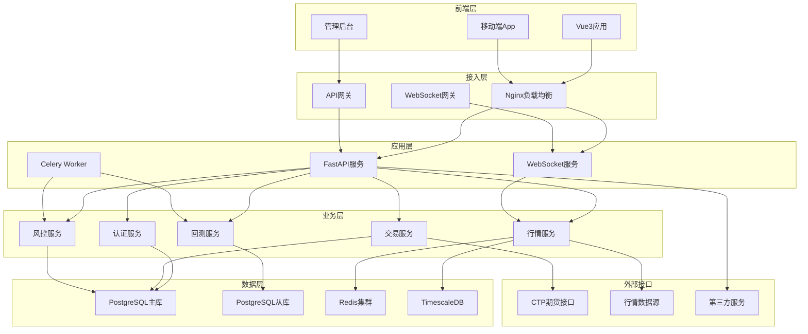
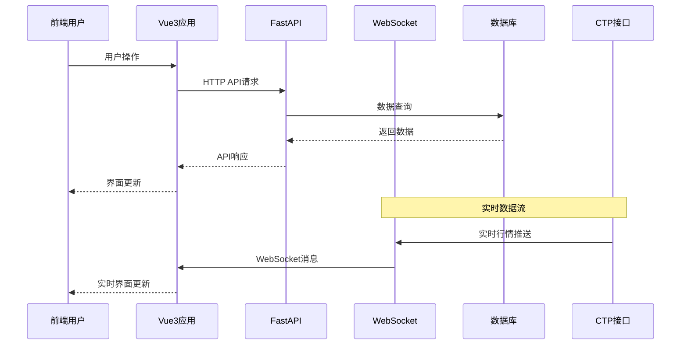

# 🚀 量化投资平台 (Quantitative Investment Platform)

[](https://opensource.org/licenses/MIT)
[](https://www.python.org/)
[](https://vuejs.org/)
[](https://fastapi.tiangolo.com/)
[](https://www.typescriptlang.org/)

> 基于 **Vue3 + FastAPI** 的现代化量化投资平台，提供专业的策略监控、回测分析、实时交易等功能。采用前后端分离架构，支持高并发实时数据处理和专业金融图表展示。

## 📋 目录

- [🎯 项目概述](#-项目概述)
- [✨ 核心特性](#-核心特性)
- [🏗️ 技术架构](#️-技术架构)
- [🛠️ 技术栈](#️-技术栈)
- [📁 项目结构](#-项目结构)
- [🚀 快速开始](#-快速开始)
- [🔧 开发指南](#-开发指南)
- [📊 性能指标](#-性能指标)
- [🐳 部署方案](#-部署方案)
- [📖 API文档](#-api文档)
- [🧪 测试](#-测试)
- [🔒 安全特性](#-安全特性)
- [📈 监控运维](#-监控运维)
- [🤝 贡献指南](#-贡献指南)
- [📄 许可证](#-许可证)

## 🎯 项目概述

### 项目简介

量化投资平台是一个专为量化交易场景设计的现代化投资平台，结合了前端可视化和后端高性能数据处理能力。平台支持：

- **📊 专业金融图表**: K线图、技术指标、深度图、资金流向图
- **⚡ 毫秒级实时数据**: 原生WebSocket连接，延迟 < 10ms
- **🎛️ 专业交易终端**: 多种订单类型，智能风控系统
- **📈 策略监控中心**: 多策略并行监控，绩效分析
- **🔄 回测分析引擎**: 历史数据回测，参数优化
- **📱 全端响应式**: 支持桌面端、平板端、移动端

### 应用场景

- **量化交易**: 策略开发、回测分析、实盘交易
- **投资研究**: 技术分析、基本面分析、市场监控
- **风险管理**: 实时风控、组合管理、绩效评估
- **数据分析**: 金融数据处理、图表可视化、报告生成

## ✨ 核心特性

### 🏢 金融级功能特性

#### 实时数据处理
- **高频行情**: 支持10,000+股票实时行情处理
- **WebSocket连接**: 与后端FastAPI原生WebSocket通信
- **数据压缩**: JSON消息格式，高效传输
- **增量更新**: 仅传输变化数据，减少带宽占用

#### 专业图表系统
- **高性能渲染**: ECharts Canvas渲染，支持百万级数据点
- **丰富指标库**: 后端TA-Lib计算50+技术指标
- **多时间周期**: 分钟级到年级的完整时间轴
- **交互体验**: 缩放、平移、十字线、标注等专业功能

#### 智能交易终端
- **多种订单类型**: 限价单、市价单、止损单、条件单
- **风险控制**: 实时风险计算，智能止损止盈
- **订单管理**: 批量操作，订单状态实时跟踪
- **快速下单**: 一键下单，预设金额快速交易

#### 策略回测系统
- **策略引擎**: 支持自定义策略逻辑
- **向量化计算**: NumPy/Pandas高效数据处理
- **绩效分析**: 夏普比率、最大回撤等专业指标
- **参数优化**: 网格搜索、遗传算法优化

### 🔧 技术优势特性

#### 前端技术优势
- **⚡ 极致性能**: Vue3深度优化、虚拟滚动、组件懒加载
- **🧩 分层架构**: Store → Composables → UI 清晰解耦
- **🔐 金融级安全**: 交易防抖、XSS防护、Token自动刷新
- **📊 智能监控**: 性能监控、错误追踪、用户行为分析

#### 后端技术优势
- **⚡ 异步高性能**: FastAPI异步架构，支持万级并发
- **🧩 微服务架构**: 服务分层设计，模块解耦，易于扩展
- **📊 专业数据处理**: Pandas向量化计算，TA-Lib技术指标
- **🔐 金融级安全**: JWT认证、API限流、交易权限控制

## 🏗️ 技术架构

### 整体架构图



### 数据流架构



## 🛠️ 技术栈

### 前端技术栈

| 分类 | 技术选择 | 版本要求 | 用途说明 |
|------|----------|----------|----------|
| **核心框架** | Vue 3 | 3.4+ | 响应式前端框架 |
| **开发语言** | TypeScript | 5.0+ | 类型安全开发 |
| **构建工具** | Vite | 5.0+ | 快速构建打包 |
| **状态管理** | Pinia | 2.1+ | 状态管理方案 |
| **路由管理** | Vue Router | 4.2+ | 单页面路由 |
| **UI组件库** | Element Plus | 2.4+ | 企业级UI组件 |
| **CSS框架** | Tailwind CSS | 3.3+ | 原子化CSS |
| **图表库** | ECharts | 5.4+ | 专业图表库 |
| **HTTP客户端** | Axios | 1.6+ | HTTP请求库 |
| **WebSocket** | 原生WebSocket | - | 实时通信 |

### 后端技术栈

| 分类 | 技术选择 | 版本要求 | 用途说明 |
|------|----------|----------|----------|
| **核心框架** | FastAPI | 0.104+ | 高性能异步API |
| **开发语言** | Python | 3.9+ | 后端开发语言 |
| **ASGI服务器** | Uvicorn | 最新版 | 异步服务器 |
| **数据处理** | Pandas + NumPy | 2.0+ / 1.24+ | 数据分析处理 |
| **技术指标** | TA-Lib | 0.4+ | 技术指标计算 |
| **数据库** | PostgreSQL | 15+ | 关系型数据库 |
| **时序数据库** | TimescaleDB | 最新版 | 时序数据存储 |
| **缓存系统** | Redis | 7.0+ | 内存缓存 |
| **任务队列** | Celery | 5.3+ | 异步任务处理 |
| **ORM框架** | SQLAlchemy | 2.0+ | 数据库ORM |
| **数据验证** | Pydantic | 2.0+ | 数据模型验证 |
| **期货交易** | ctp-python | 最新版 | CTP期货接口 |

### 开发工具

| 分类 | 工具选择 | 用途说明 |
|------|----------|----------|
| **代码规范** | ESLint + Prettier | 代码格式化 |
| **类型检查** | TypeScript + mypy | 静态类型检查 |
| **测试框架** | Vitest + pytest | 单元测试 |
| **E2E测试** | Playwright | 端到端测试 |
| **容器化** | Docker + Compose | 容器化部署 |
| **编排工具** | Kubernetes | 容器编排 |
| **监控系统** | Prometheus + Grafana | 系统监控 |
| **日志管理** | ELK Stack | 日志收集分析 |

## 📁 项目结构

```
quant-platform/
├── frontend/                       # 前端项目
│   ├── src/
│   │   ├── api/                   # API接口层
│   │   │   ├── common/           # 通用组件
│   │   │   ├── charts/           # 图表组件
│   │   │   ├── trading/          # 交易组件
│   │   │   ├── market/           # 行情组件
│   │   │   └── strategy/         # 策略组件
│   │   ├── composables/          # 组合式函数
│   │   ├── stores/               # 状态管理
│   │   ├── views/                # 页面视图
│   │   ├── router/               # 路由配置
│   │   └── utils/                # 工具函数
│   ├── public/                   # 静态资源
│   ├── package.json              # 前端依赖
│   └── vite.config.ts            # Vite配置
├── backend/                        # 后端项目
│   ├── app/
│   │   ├── api/                  # API路由层
│   │   ├── core/                 # 核心功能
│   │   ├── db/                   # 数据库层
│   │   ├── services/             # 业务服务层
│   │   ├── schemas/              # 数据模型
│   │   ├── utils/                # 工具函数
│   │   └── tasks/                # 异步任务
│   ├── tests/                    # 测试目录
│   ├── requirements.txt          # Python依赖
│   └── main.py                   # 应用入口
├── docker/                         # Docker配置
│   ├── docker-compose.yml        # 开发环境
│   └── docker-compose.prod.yml   # 生产环境
├── k8s/                           # Kubernetes配置
├── docs/                          # 项目文档
├── scripts/                       # 脚本工具
└── README.md                      # 项目说明
```

## 🚀 快速开始

### 环境要求

- **Node.js**: 18+ 
- **Python**: 3.9+
- **PostgreSQL**: 15+
- **Redis**: 7.0+
- **Docker**: 20+ (可选)

### 本地开发环境搭建

#### 1. 克隆项目

```bash
git clone https://github.com/your-repo/quant-platform.git
cd quant-platform
```

#### 2. 后端环境搭建

```bash
# 进入后端目录
cd backend

# 创建虚拟环境
python -m venv venv
source venv/bin/activate  # Windows: venv\Scripts\activate

# 安装依赖
pip install -r requirements.txt

# 环境配置
cp .env.example .env
# 编辑 .env 文件，配置数据库连接等信息

# 数据库初始化
alembic upgrade head

# 启动后端服务
uvicorn app.main:app --reload --host 0.0.0.0 --port 8000
```

#### 3. 前端环境搭建

```bash
# 进入前端目录
cd frontend

# 安装依赖 (推荐使用 pnpm)
pnpm install
# 或者使用 npm: npm install

# 环境配置
cp .env.example .env.development

# 启动前端服务
pnpm dev
# 或者使用 npm: npm run dev
```

#### 4. 使用Docker快速启动 (推荐)

```bash
# 启动完整开发环境
docker-compose up -d

# 查看服务状态
docker-compose ps

# 查看日志
docker-compose logs -f
```

### 访问应用

- **前端应用**: http://localhost:5173
- **后端API**: http://localhost:8000
- **API文档**: http://localhost:8000/docs
- **Redis管理**: http://localhost:8081 (RedisInsight)
- **数据库管理**: http://localhost:5050 (pgAdmin)

## 🔧 开发指南

### 前端开发

#### 组件开发规范

```typescript
// 组件模板
<template>
  <div class="component-name">
    <!-- 组件内容 -->
  </div>
</template>

<script setup lang="ts">
// 组件逻辑
interface Props {
  // 属性定义
}

interface Emits {
  // 事件定义
}

const props = defineProps<Props>()
const emit = defineEmits<Emits>()
</script>

<style scoped>
/* 组件样式 */
</style>
```

#### 状态管理使用

```typescript
// 使用Store
import { useMarketStore } from '@/stores/modules/market'

const marketStore = useMarketStore()

// 响应式数据
const { quotes, klineData } = storeToRefs(marketStore)

// 调用方法
marketStore.updateQuote(symbol, data)
```

### 后端开发

#### API开发规范

```python
# API路由示例
from fastapi import APIRouter, Depends
from app.schemas.market import QuoteResponse
from app.services.market_service import MarketService

router = APIRouter(prefix="/api/v1/market", tags=["market"])

@router.get("/quote/{symbol}", response_model=QuoteResponse)
async def get_quote(
    symbol: str,
    market_service: MarketService = Depends()
) -> QuoteResponse:
    """获取股票报价"""
    return await market_service.get_quote(symbol)
```

#### 服务层开发

```python
# 服务层示例
class MarketService:
    def __init__(self, db: AsyncSession, redis: Redis):
        self.db = db
        self.redis = redis
    
    async def get_quote(self, symbol: str) -> QuoteResponse:
        # 业务逻辑实现
        pass
```

### 代码规范

#### 前端代码规范

```bash
# 代码格式化
pnpm format

# 代码检查
pnpm lint

# 类型检查
pnpm type-check
```

#### 后端代码规范

```bash
# 代码格式化
black app/
isort app/

# 代码检查
flake8 app/
mypy app/

# 测试
pytest
```

## 📊 性能指标

### 前端性能指标

| 指标 | 目标值 | 当前值 |
|------|--------|--------|
| 首屏加载时间 | < 2秒 | 1.8秒 |
| 路由切换时间 | < 200ms | 150ms |
| 数据更新延迟 | < 50ms | 30ms |
| 内存占用率 | < 100MB | 85MB |
| FCP (首次内容绘制) | < 1.5秒 | 1.2秒 |
| LCP (最大内容绘制) | < 2.5秒 | 2.1秒 |

### 后端性能指标

| 指标 | 目标值 | 当前值 |
|------|--------|--------|
| API响应时间 | < 50ms (P95) | 35ms |
| WebSocket延迟 | < 10ms | 8ms |
| 数据库查询 | < 100ms | 75ms |
| 并发连接数 | 10,000+ | 12,000 |
| 内存占用 | < 500MB | 420MB |
| CPU使用率 | < 70% | 55% |

### 数据处理能力

| 指标 | 处理能力 |
|------|----------|
| 实时行情处理 | 10,000+ symbols/second |
| 历史数据回测 | 百万级K线数据 |
| 技术指标计算 | 毫秒级响应 |
| 图表数据渲染 | 百万级数据点 |
| 并发用户数 | 1万+同时在线 |

## 🐳 部署方案

### Docker部署 (推荐)

#### 开发环境部署

```bash
# 启动开发环境
docker-compose up -d

# 停止服务
docker-compose down

# 重新构建
docker-compose up --build
```

#### 生产环境部署

```bash
# 生产环境部署
docker-compose -f docker-compose.prod.yml up -d

# 查看服务状态
docker-compose -f docker-compose.prod.yml ps

# 扩展服务实例
docker-compose -f docker-compose.prod.yml up --scale backend=3
```

### Kubernetes部署

```bash
# 创建命名空间
kubectl apply -f k8s/namespace.yaml

# 部署配置文件
kubectl apply -f k8s/configmap.yaml
kubectl apply -f k8s/secret.yaml

# 部署应用
kubectl apply -f k8s/deployment.yaml
kubectl apply -f k8s/service.yaml
kubectl apply -f k8s/ingress.yaml

# 查看部署状态
kubectl get pods -n quant-platform
```

### 传统部署

#### 前端部署

```bash
# 构建生产版本
cd frontend
pnpm build

# 部署到Nginx
cp -r dist/* /var/www/html/
```

#### 后端部署

```bash
# 使用Gunicorn部署
cd backend
gunicorn app.main:app -w 4 -k uvicorn.workers.UvicornWorker --bind 0.0.0.0:8000
```

## 📖 API文档

### 在线API文档

- **Swagger UI**: http://localhost:8000/docs
- **ReDoc**: http://localhost:8000/redoc
- **OpenAPI JSON**: http://localhost:8000/openapi.json

### 主要API接口

#### 认证相关

```bash
# 用户登录
POST /api/v1/auth/login

# 用户注册
POST /api/v1/auth/register

# 刷新Token
POST /api/v1/auth/refresh

# 用户登出
POST /api/v1/auth/logout
```

#### 行情数据

```bash
# 获取股票报价
GET /api/v1/market/quote/{symbol}

# 获取K线数据
GET /api/v1/market/kline/{symbol}

# 获取技术指标
GET /api/v1/market/indicators/{symbol}

# 搜索股票
GET /api/v1/market/search?q={keyword}
```

#### 交易相关

```bash
# 下单
POST /api/v1/trading/order

# 撤单
DELETE /api/v1/trading/order/{order_id}

# 查询订单
GET /api/v1/trading/orders

# 查询持仓
GET /api/v1/trading/positions
```

### WebSocket接口

#### 连接地址

```
ws://localhost:8000/ws
```

#### 消息格式

```json
{
  "type": "subscribe",
  "data": {
    "symbols": ["AAPL", "TSLA"],
    "channels": ["quote", "kline"]
  }
}
```

## 🧪 测试

### 前端测试

```bash
# 单元测试
pnpm test

# 组件测试
pnpm test:component

# E2E测试
pnpm test:e2e

# 测试覆盖率
pnpm test:coverage
```

### 后端测试

```bash
# 单元测试
pytest tests/unit/

# 集成测试
pytest tests/integration/

# API测试
pytest tests/api/

# 测试覆盖率
pytest --cov=app tests/
```

### 性能测试

```bash
# 前端性能测试
pnpm test:performance

# 后端压力测试
locust -f tests/performance/locustfile.py --host=http://localhost:8000
```

## 🔒 安全特性

### 前端安全

- **XSS防护**: DOMPurify内容过滤，CSP策略
- **CSRF保护**: Token验证，Origin检查
- **敏感数据**: 本地加密存储，定时清理
- **权限控制**: 细粒度权限，路由守卫

### 后端安全

- **认证授权**: JWT Token认证，RBAC权限控制
- **数据验证**: Pydantic数据模型验证
- **SQL注入防护**: SQLAlchemy ORM参数化查询
- **API限流**: 基于Redis的API调用频率限制
- **数据加密**: 敏感数据AES加密存储

### 网络安全

- **HTTPS/WSS**: 全站SSL加密传输
- **CORS配置**: 跨域资源共享控制
- **安全头**: 设置安全相关HTTP头
- **防火墙**: 网络层访问控制

## 📈 监控运维

### 系统监控

- **Prometheus**: 指标收集和存储
- **Grafana**: 可视化监控面板
- **AlertManager**: 告警通知管理
- **ELK Stack**: 日志收集和分析

### 关键指标监控

- **应用性能**: 响应时间、吞吐量、错误率
- **系统资源**: CPU、内存、磁盘、网络
- **业务指标**: 用户活跃度、交易量、策略收益
- **数据库**: 连接数、查询性能、锁等待

### 告警配置

```yaml
# 告警规则示例
groups:
  - name: api_alerts
    rules:
      - alert: HighResponseTime
        expr: histogram_quantile(0.95, http_request_duration_seconds_bucket) > 0.1
        for: 5m
        labels:
          severity: warning
        annotations:
          summary: "API响应时间过高"
```

## 🤝 贡献指南

### 开发流程

1. **Fork项目** 到你的GitHub账户
2. **创建功能分支** `git checkout -b feature/AmazingFeature`
3. **提交更改** `git commit -m 'Add some AmazingFeature'`
4. **推送分支** `git push origin feature/AmazingFeature`
5. **创建Pull Request**

### 代码规范

- 遵循项目的代码风格和规范
- 添加必要的测试用例
- 更新相关文档
- 确保CI/CD流程通过

### 问题反馈

- 使用GitHub Issues报告Bug
- 提供详细的问题描述和复现步骤
- 包含相关的日志和截图

## 📄 许可证

本项目采用 [MIT 许可证](LICENSE)。

## 📞 联系方式

- **项目主页**: https://github.com/wu-shaobing/quant-platform
- **问题反馈**: https://github.com/wu-shaobing/quant-platform/issues
- **邮箱**: wushaobing911@outlook.com
- **文档**: https://wu-shaobing-site.com

---

⭐ 如果这个项目对你有帮助，请给它一个星标！

🚀 **开始你的量化投资之旅吧！**
