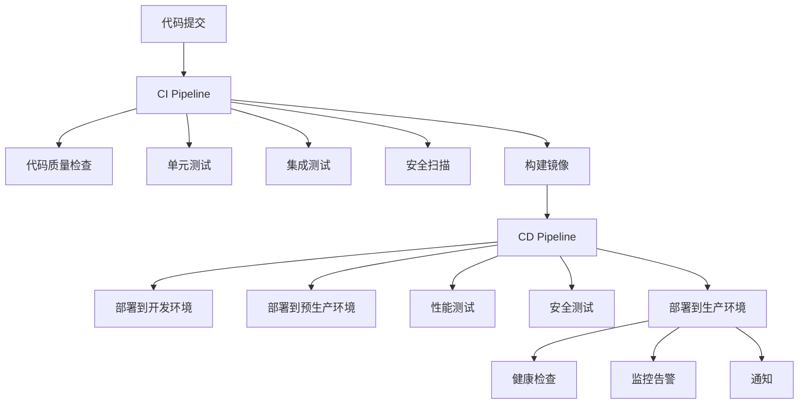

# CI/CD流水线文档

## 概述

本文档描述了量化投资平台的完整CI/CD流水线架构、配置和使用方法。

## 架构概览



## CI流水线 (Continuous Integration)

### 触发条件
- 推送到 `main`、`develop`、`feature/*` 分支
- 创建Pull Request到 `main`、`develop` 分支

### 流水线阶段

#### 1. 代码质量检查 (Code Quality)
```yaml
- Python代码格式化检查 (black, isort)
- Python代码规范检查 (flake8, mypy)
- Python安全检查 (bandit, safety)
- 前端代码检查 (ESLint, TypeScript)
```

#### 2. 后端测试 (Backend Tests)
```yaml
- 单元测试 (pytest)
- 集成测试 (pytest + PostgreSQL + Redis)
- 覆盖率报告 (codecov)
```

#### 3. 前端测试 (Frontend Tests)
```yaml
- 单元测试 (Vitest)
- 组件测试 (Vue Test Utils)
- 构建测试 (Vite build)
```

#### 4. E2E测试 (End-to-End Tests)
```yaml
- 启动完整服务栈
- Playwright自动化测试
- 用户流程验证
```

#### 5. 安全扫描 (Security Scan)
```yaml
- 代码漏洞扫描 (Trivy)
- 依赖安全检查 (CodeQL)
- SARIF报告上传
```

#### 6. 镜像构建 (Build Images)
```yaml
- 多阶段Docker构建
- 镜像安全扫描
- 推送到容器仓库 (GHCR)
```

## CD流水线 (Continuous Deployment)

### 触发条件
- CI流水线成功完成
- 分支为 `main` 或 `develop`

### 部署环境

#### 1. 开发环境 (Development)
- **触发分支**: `develop`
- **自动部署**: 是
- **环境**: Kubernetes开发集群
- **域名**: `dev.your-domain.com` (示例)

#### 2. 预生产环境 (Staging)
- **触发分支**: `main`
- **自动部署**: 是
- **环境**: Kubernetes预生产集群
- **域名**: `staging.your-domain.com` (示例)
- **测试**: 集成测试、性能测试、安全测试

#### 3. 生产环境 (Production)
- **触发分支**: `main`
- **自动部署**: 需要预生产环境测试通过
- **环境**: Kubernetes生产集群
- **域名**: `your-domain.com` (示例)
- **策略**: 蓝绿部署、自动回滚

### 部署流程

#### 1. 部署前检查
```bash
- 检查依赖工具 (kubectl, docker, jq)
- 验证Kubernetes连接
- 备份当前部署配置
```

#### 2. 镜像部署
```bash
- 更新Kubernetes配置
- 应用新的部署配置
- 等待Pod就绪
```

#### 3. 健康检查
```bash
- HTTP健康检查
- API端点验证
- 数据库连接检查
- 缓存连接检查
```

#### 4. 回滚机制
```bash
- 自动检测部署失败
- 恢复备份配置
- 通知相关人员
```

## 配置文件说明

### GitHub Actions工作流

#### CI流水线 (`.github/workflows/ci.yml`)
```yaml
name: CI Pipeline
on:
  push:
    branches: [ main, develop, feature/* ]
  pull_request:
    branches: [ main, develop ]

jobs:
  - code-quality      # 代码质量检查
  - backend-tests     # 后端测试
  - frontend-tests    # 前端测试
  - e2e-tests        # E2E测试
  - security-scan    # 安全扫描
  - build-images     # 镜像构建
```

#### CD流水线 (`.github/workflows/cd.yml`)
```yaml
name: CD Pipeline
on:
  workflow_run:
    workflows: ["CI Pipeline"]
    types: [completed]
    branches: [main, develop]

jobs:
  - deploy-dev       # 部署到开发环境
  - deploy-staging   # 部署到预生产环境
  - deploy-production # 部署到生产环境
```

### Docker配置

#### 后端Dockerfile (`backend/Dockerfile`)
```dockerfile
# 多阶段构建
FROM python:3.11-slim as base
FROM base as development
FROM base as test
FROM base as builder
FROM python:3.11-slim as production
```

#### 前端Dockerfile (`frontend/Dockerfile`)
```dockerfile
# 多阶段构建
FROM node:18-alpine as base
FROM base as development
FROM base as test
FROM base as builder
FROM nginx:1.25-alpine as production
```

### Kubernetes配置

#### 开发环境 (`k8s/dev/`)
```
- namespace.yaml    # 命名空间和资源配额
- configmap.yaml    # 配置映射
- secrets.yaml      # 密钥配置
- deployment.yaml   # 部署配置
- service.yaml      # 服务配置
- ingress.yaml      # 入口配置
- pvc.yaml         # 持久卷声明
```

## 环境变量配置

### GitHub Secrets
```yaml
# 容器仓库
GITHUB_TOKEN: GitHub访问令牌

# Kubernetes配置
KUBE_CONFIG_DEV: 开发环境kubeconfig
KUBE_CONFIG_STAGING: 预生产环境kubeconfig
KUBE_CONFIG_PROD: 生产环境kubeconfig

# 通知配置
SLACK_WEBHOOK: Slack通知Webhook
ALERT_EMAIL: 告警邮箱地址
SMTP_USERNAME: SMTP用户名
SMTP_PASSWORD: SMTP密码

# 监控配置
MONITORING_API_TOKEN: 监控系统API令牌
```

### 环境特定配置
```yaml
# 开发环境
CTP_ENVIRONMENT: development
CTP_LOG_LEVEL: DEBUG
DATABASE_URL: postgresql://...
REDIS_URL: redis://...

# 生产环境
CTP_ENVIRONMENT: production
CTP_LOG_LEVEL: INFO
DATABASE_URL: postgresql://...
REDIS_URL: redis://...
```

## 监控和告警

### 指标收集
```yaml
- 部署成功率
- 部署持续时间
- 测试覆盖率
- 安全漏洞数量
- 构建失败率
```

### 告警规则
```yaml
- 部署失败 → Slack + 邮件通知
- 测试覆盖率下降 → Slack通知
- 安全漏洞发现 → 立即通知
- 构建时间过长 → 性能告警
```

### 仪表板
- Grafana CI/CD仪表板
- 部署历史追踪
- 性能趋势分析
- 安全状态监控

## 使用指南

### 开发者工作流

#### 1. 功能开发
```bash
# 创建功能分支
git checkout -b feature/new-feature

# 开发和提交
git add .
git commit -m "feat: add new feature"

# 推送分支
git push origin feature/new-feature
```

#### 2. 创建Pull Request
- 自动触发CI流水线
- 代码质量检查
- 自动化测试
- 安全扫描

#### 3. 合并到develop
- 自动部署到开发环境
- 集成测试验证
- 功能验收测试

#### 4. 发布到生产
```bash
# 合并到main分支
git checkout main
git merge develop

# 自动触发完整CD流水线
# 1. 部署到预生产环境
# 2. 性能和安全测试
# 3. 部署到生产环境
```

### 运维操作

#### 手动部署
```bash
# 使用部署脚本
./scripts/deploy_production.sh v1.0.0

# 跳过构建，直接部署
./scripts/deploy_production.sh latest true
```

#### 回滚操作
```bash
# 自动回滚（部署失败时）
# 手动回滚到指定版本
kubectl rollout undo deployment/quant-platform-backend -n quant-platform-prod
```

#### 监控检查
```bash
# 检查部署状态
kubectl get pods -n quant-platform-prod

# 查看日志
kubectl logs -f deployment/quant-platform-backend -n quant-platform-prod

# 健康检查
curl -f https://your-domain.com/health
```

## 故障排除

### 常见问题

#### 1. 构建失败
```bash
# 检查依赖版本
# 验证代码格式
# 查看构建日志
```

#### 2. 测试失败
```bash
# 检查测试环境配置
# 验证数据库连接
# 查看测试报告
```

#### 3. 部署失败
```bash
# 检查Kubernetes资源
# 验证镜像可用性
# 查看Pod日志
```

#### 4. 健康检查失败
```bash
# 检查服务端口
# 验证配置正确性
# 查看应用日志
```

### 调试工具
```bash
# 本地测试
docker-compose -f docker-compose.test.yml up

# 性能测试
k6 run tests/performance/load_test.js

# 安全扫描
python tests/security/zap_baseline.py
```

## 最佳实践

### 代码质量
- 保持高测试覆盖率 (>80%)
- 遵循代码规范
- 定期更新依赖
- 及时修复安全漏洞

### 部署策略
- 使用蓝绿部署减少停机时间
- 实施自动回滚机制
- 监控部署指标
- 定期备份配置

### 安全考虑
- 定期安全扫描
- 最小权限原则
- 密钥轮换
- 访问日志审计

### 性能优化
- 镜像层缓存
- 并行构建
- 增量部署
- 资源限制

## 更新日志

### v1.0.0 (2024-12-01)
- 初始CI/CD流水线实现
- 多环境部署支持
- 自动化测试集成
- 监控告警配置

### v1.1.0 (2024-12-15)
- 添加安全扫描
- 优化构建性能
- 增强错误处理
- 完善文档

> 注：以上域名为示例配置，请根据实际项目情况更新为真实的域名。
