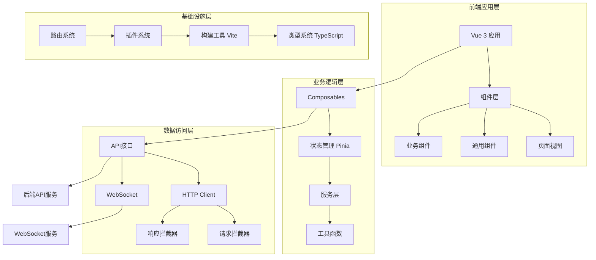
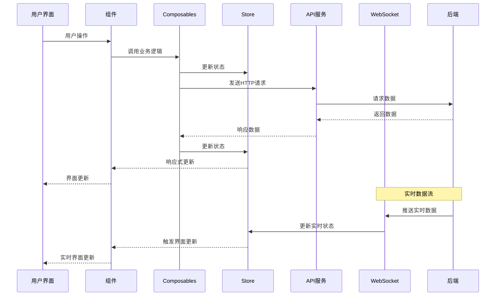

# 技术架构设计

## 🏗️ 整体架构

### 系统架构图



### 🔄 数据流架构



## 🗄️ 状态管理架构

### Pinia Store 设计

```typescript
// 状态管理架构设计
interface StoreArchitecture {
  // 核心Store
  auth: AuthStore          // 认证状态
  user: UserStore          // 用户信息
  ui: UIStore             // UI状态
  
  // 业务Store
  market: MarketStore      // 行情数据
  trading: TradingStore    // 交易数据
  strategy: StrategyStore  // 策略数据
  backtest: BacktestStore  // 回测数据
  portfolio: PortfolioStore // 投资组合
  
  // 辅助Store
  notification: NotificationStore // 通知
  settings: SettingsStore        // 设置
}
```

### 状态分类与职责

#### 1. 全局状态 (Global State)
```typescript
// src/stores/modules/ui.ts
export const useUIStore = defineStore('ui', () => {
  // 主题状态
  const theme = ref<'light' | 'dark' | 'auto'>('auto')
  const isDarkMode = computed(() => {
    if (theme.value === 'auto') {
      return window.matchMedia('(prefers-color-scheme: dark)').matches
    }
    return theme.value === 'dark'
  })
  
  // 布局状态
  const sidebarCollapsed = ref(false)
  const fullscreen = ref(false)
  
  // 加载状态
  const loading = ref(false)
  const loadingText = ref('')
  
  // 操作方法
  const toggleTheme = () => {
    const themes = ['light', 'dark', 'auto']
    const currentIndex = themes.indexOf(theme.value)
    theme.value = themes[(currentIndex + 1) % themes.length] as any
  }
  
  const toggleSidebar = () => {
    sidebarCollapsed.value = !sidebarCollapsed.value
  }
  
  const setLoading = (state: boolean, text = '') => {
    loading.value = state
    loadingText.value = text
  }
  
  return {
    // 状态
    theme,
    isDarkMode,
    sidebarCollapsed,
    fullscreen,
    loading,
    loadingText,
    
    // 操作
    toggleTheme,
    toggleSidebar,
    setLoading
  }
})
```

#### 2. 业务状态 (Business State)
```typescript
// src/stores/modules/market.ts
export const useMarketStore = defineStore('market', () => {
  // 行情数据状态
  const quotes = ref<Map<string, QuoteData>>(new Map())
  const klineData = ref<Map<string, KLineData[]>>(new Map())
  const watchlist = ref<string[]>([])
  
  // 订阅状态
  const subscriptions = ref<Set<string>>(new Set())
  
  // WebSocket连接状态
  const wsConnected = ref(false)
  const wsReconnectCount = ref(0)
  
  // 计算属性
  const watchlistQuotes = computed(() => {
    return watchlist.value.map(symbol => quotes.value.get(symbol)).filter(Boolean)
  })
  
  // 操作方法
  const updateQuote = (symbol: string, data: QuoteData) => {
    quotes.value.set(symbol, data)
  }
  
  const updateKLineData = (symbol: string, data: KLineData[]) => {
    klineData.value.set(symbol, data)
  }
  
  const addToWatchlist = (symbol: string) => {
    if (!watchlist.value.includes(symbol)) {
      watchlist.value.push(symbol)
      subscribeSymbol(symbol)
    }
  }
  
  const removeFromWatchlist = (symbol: string) => {
    const index = watchlist.value.indexOf(symbol)
    if (index > -1) {
      watchlist.value.splice(index, 1)
      unsubscribeSymbol(symbol)
    }
  }
  
  const subscribeSymbol = (symbol: string) => {
    subscriptions.value.add(symbol)
    // WebSocket订阅逻辑
  }
  
  const unsubscribeSymbol = (symbol: string) => {
    subscriptions.value.delete(symbol)
    // WebSocket取消订阅逻辑
  }
  
  return {
    // 状态
    quotes,
    klineData,
    watchlist,
    subscriptions,
    wsConnected,
    wsReconnectCount,
    
    // 计算属性
    watchlistQuotes,
    
    // 操作
    updateQuote,
    updateKLineData,
    addToWatchlist,
    removeFromWatchlist,
    subscribeSymbol,
    unsubscribeSymbol
  }
})
```

#### 3. 本地状态 (Local State)
```typescript
// 组件内部状态，使用 Composables 管理
export const useOrderForm = () => {
  const form = reactive({
    symbol: '',
    side: 'buy' as 'buy' | 'sell',
    type: 'limit' as 'limit' | 'market',
    price: 0,
    quantity: 0
  })
  
  const rules = {
    symbol: [{ required: true, message: '请选择股票' }],
    price: [{ required: true, message: '请输入价格' }],
    quantity: [{ required: true, message: '请输入数量' }]
  }
  
  const submitOrder = async () => {
    // 提交订单逻辑
  }
  
  const resetForm = () => {
    Object.assign(form, {
      symbol: '',
      side: 'buy',
      type: 'limit',
      price: 0,
      quantity: 0
    })
  }
  
  return {
    form,
    rules,
    submitOrder,
    resetForm
  }
}
```

## 🔌 组合式函数架构

### Composables 分层设计

```typescript
// 组合式函数架构
interface ComposablesArchitecture {
  // 核心层 - 通用功能
  core: {
    useLocalStorage: Function    // 本地存储
    useEventListener: Function   // 事件监听
    useClipboard: Function      // 剪贴板
    useFullscreen: Function     // 全屏控制
    useMediaQuery: Function     // 媒体查询
  }
  
  // 业务层 - 业务逻辑
  business: {
    useAuth: Function           // 认证逻辑
    useMarketData: Function     // 行情数据
    useTradingLogic: Function   // 交易逻辑
    useStrategyEngine: Function // 策略引擎
    useRiskControl: Function    // 风险控制
  }
  
  // UI层 - 界面交互
  ui: {
    useModal: Function          // 模态框
    useToast: Function         // 消息提示
    useLoading: Function       // 加载状态
    useForm: Function          // 表单处理
    useTable: Function         // 表格处理
  }
  
  // 数据层 - 数据处理
  data: {
    useApi: Function           // API调用
    useWebSocket: Function     // WebSocket
    useCache: Function         // 缓存管理
    usePagination: Function    // 分页处理
  }
}
```

### 核心 Composables 实现

#### 1. WebSocket 管理
```typescript
// src/composables/data/useWebSocket.ts
import { ref, onUnmounted } from 'vue'

export const useWebSocket = (url: string) => {
  const socket = ref<WebSocket>()
  const connected = ref(false)
  const reconnectAttempts = ref(0)
  const maxReconnectAttempts = 5
  
  let reconnectTimer: NodeJS.Timeout | null = null
  let heartbeatTimer: NodeJS.Timeout | null = null
  
  // 连接WebSocket
  const connect = () => {
    if (socket.value?.readyState === WebSocket.OPEN) return
    
    socket.value = new WebSocket(url)
    
    socket.value.onopen = () => {
      connected.value = true
      reconnectAttempts.value = 0
      console.log('WebSocket connected to FastAPI backend')
      
      // 发送认证消息
      if (socket.value?.readyState === WebSocket.OPEN) {
        const authToken = localStorage.getItem('auth_token')
        socket.value.send(JSON.stringify({
          type: 'auth',
          data: { token: authToken }
        }))
      }
      
      // 启动心跳
      heartbeatTimer = setInterval(() => {
        if (socket.value?.readyState === WebSocket.OPEN) {
          socket.value.send(JSON.stringify({
            type: 'ping',
            timestamp: new Date().toISOString()
          }))
        }
      }, 30000)
    }
    
    socket.value.onclose = () => {
      connected.value = false
      clearTimers()
      console.log('WebSocket disconnected from FastAPI backend')
      attemptReconnect()
    }
    
    socket.value.onerror = (error) => {
      console.error('WebSocket error:', error)
    }
    
    socket.value.onmessage = (event) => {
      try {
        const message = JSON.parse(event.data)
        handleMessage(message)
      } catch (error) {
        console.error('Failed to parse WebSocket message:', error)
      }
    }
  }
  
  // 处理消息
  const handleMessage = (message: any) => {
    switch (message.type) {
      case 'pong':
        // 心跳响应
        break
      case 'auth_response':
        console.log('Authentication status:', message.data.status)
        break
      case 'market_data':
        // 处理行情数据
        break
      case 'order_update':
        // 处理订单更新
        break
      default:
        console.log('Unknown message type:', message.type)
    }
  }
  
  // 重连机制
  const attemptReconnect = () => {
    if (reconnectAttempts.value >= maxReconnectAttempts) {
      console.error('Max reconnect attempts reached')
      return
    }
    
    reconnectAttempts.value++
    
    reconnectTimer = setTimeout(() => {
      if (!connected.value) {
        connect()
      }
    }, Math.pow(2, reconnectAttempts.value) * 1000) // 指数退避
  }
  
  // 清理定时器
  const clearTimers = () => {
    if (reconnectTimer) {
      clearTimeout(reconnectTimer)
      reconnectTimer = null
    }
    if (heartbeatTimer) {
      clearInterval(heartbeatTimer)
      heartbeatTimer = null
    }
  }
  
  // 发送消息
  const send = (message: any) => {
    if (connected.value && socket.value?.readyState === WebSocket.OPEN) {
      socket.value.send(JSON.stringify(message))
    }
  }
  
  // 订阅行情
  const subscribeMarketData = (symbols: string[]) => {
    send({
      type: 'subscribe',
      channel: 'market_data',
      symbols,
      fields: ['last_price', 'volume', 'bid', 'ask']
    })
  }
  
  // 订阅订单更新
  const subscribeOrders = () => {
    send({
      type: 'subscribe',
      channel: 'orders'
    })
  }
  
  // 取消订阅
  const unsubscribe = (channel: string, symbols?: string[]) => {
    send({
      type: 'unsubscribe',
      channel,
      symbols
    })
  }
  
  // 断开连接
  const disconnect = () => {
    clearTimers()
    
    if (socket.value) {
      socket.value.close()
      socket.value = undefined
    }
    
    connected.value = false
    reconnectAttempts.value = 0
  }
  
  // 组件卸载时清理
  onUnmounted(() => {
    disconnect()
  })
  
  return {
    socket,
    connected,
    reconnectAttempts,
    connect,
    disconnect,
    send,
    subscribeMarketData,
    subscribeOrders,
    unsubscribe
  }
}
```

#### 2. 图表管理
```typescript
// src/composables/chart/useChart.ts
import { ref, onUnmounted, nextTick } from 'vue'
import * as echarts from 'echarts'
import { debounce } from 'lodash-es'

export const useChart = (containerRef: Ref<HTMLElement | undefined>) => {
  const chart = ref<echarts.ECharts>()
  const loading = ref(false)
  
  // 防抖的resize处理
  const debouncedResize = debounce(() => {
    chart.value?.resize()
  }, 200)
  
  // 初始化图表
  const initChart = async (theme?: string) => {
    if (!containerRef.value) return
    
    await nextTick()
    
    chart.value = echarts.init(containerRef.value, theme, {
      renderer: 'canvas',
      useDirtyRect: true
    })
    
    // 监听窗口resize
    window.addEventListener('resize', debouncedResize)
  }
  
  // 更新图表配置
  const updateChart = (option: any, notMerge = false) => {
    if (!chart.value) return
    
    loading.value = true
    
    try {
      chart.value.setOption(option, notMerge)
    } catch (error) {
      console.error('Chart update error:', error)
    } finally {
      loading.value = false
    }
  }
  
  // 显示加载状态
  const showLoading = (text = '加载中...') => {
    chart.value?.showLoading('default', {
      text,
      color: '#409EFF',
      textColor: '#000',
      maskColor: 'rgba(255, 255, 255, 0.8)',
      zlevel: 0
    })
  }
  
  // 隐藏加载状态
  const hideLoading = () => {
    chart.value?.hideLoading()
  }
  
  // 销毁图表
  const disposeChart = () => {
    if (chart.value) {
      chart.value.dispose()
      chart.value = undefined
    }
    window.removeEventListener('resize', debouncedResize)
  }
  
  onUnmounted(() => {
    disposeChart()
  })
  
  return {
    chart,
    loading,
    initChart,
    updateChart,
    showLoading,
    hideLoading,
    disposeChart
  }
}
```

## 🌐 网络架构

### HTTP 客户端配置

```typescript
// src/api/http.ts
import axios, { AxiosInstance, AxiosRequestConfig, AxiosResponse } from 'axios'
import { ElMessage } from 'element-plus'
import { useAuthStore } from '@/stores/modules/auth'

// 创建axios实例
const createHttpClient = (): AxiosInstance => {
  const instance = axios.create({
    baseURL: import.meta.env.VITE_API_BASE_URL || '/api/v1',
    timeout: 10000,
    headers: {
      'Content-Type': 'application/json'
    }
  })
  
  // 请求拦截器
  instance.interceptors.request.use(
    (config) => {
      const authStore = useAuthStore()
      
      // 添加认证token
      if (authStore.token) {
        config.headers.Authorization = `Bearer ${authStore.token}`
      }
      
      // 添加请求ID用于追踪
      config.headers['X-Request-ID'] = generateRequestId()
      
      // 添加时间戳防止缓存
      if (config.method === 'get') {
        config.params = {
          ...config.params,
          _t: Date.now()
        }
      }
      
      return config
    },
    (error) => {
      console.error('Request error:', error)
      return Promise.reject(error)
    }
  )
  
  // 响应拦截器
  instance.interceptors.response.use(
    (response: AxiosResponse) => {
      const { data, config } = response
      
      // 统一处理响应格式
      if (data.code !== undefined) {
        if (data.code === 200) {
          return data.data
        } else {
          ElMessage.error(data.message || '请求失败')
          return Promise.reject(new Error(data.message))
        }
      }
      
      return data
    },
    async (error) => {
      const { response, config } = error
      
      if (response) {
        switch (response.status) {
          case 401:
            // Token过期，尝试刷新
            const authStore = useAuthStore()
            try {
              await authStore.refreshToken()
              // 重新发送原请求
              return instance(config)
            } catch {
              authStore.logout()
              window.location.href = '/login'
            }
            break
            
          case 403:
            ElMessage.error('没有权限访问该资源')
            break
            
          case 404:
            ElMessage.error('请求的资源不存在')
            break
            
          case 500:
            ElMessage.error('服务器内部错误')
            break
            
          default:
            ElMessage.error(`请求失败: ${response.status}`)
        }
      } else {
        ElMessage.error('网络连接失败')
      }
      
      return Promise.reject(error)
    }
  )
  
  return instance
}

// 生成请求ID
const generateRequestId = (): string => {
  return `${Date.now()}-${Math.random().toString(36).substr(2, 9)}`
}

export const http = createHttpClient()
```

### API 模块设计

```typescript
// src/api/modules/market.ts
import { http } from '../http'
import type { 
  QuoteData, 
  KLineData, 
  MarketSearchResult,
  MarketOverviewData 
} from '@/types/api/market'

export const marketApi = {
  // 获取实时行情
  getQuote: (symbol: string): Promise<QuoteData> => {
    return http.get(`/market/data/${symbol}`)
  },
  
  // 获取K线数据
  getKLineData: (params: {
    symbol: string
    period: string
    limit?: number
    startTime?: number
    endTime?: number
  }): Promise<KLineData[]> => {
    return http.get(`/market/klines/${params.symbol}`, { 
      params: { 
        period: params.period, 
        limit: params.limit,
        start_time: params.startTime,
        end_time: params.endTime
      } 
    })
  },
  
  // 搜索股票
  searchStocks: (keyword: string): Promise<MarketSearchResult[]> => {
    return http.get('/market/symbols', { 
      params: { keyword } 
    })
  },
  
  // 获取市场概览
  getMarketOverview: (): Promise<MarketOverviewData> => {
    return http.get('/market/overview')
  },
  
  // 获取板块数据
  getSectorData: (): Promise<any[]> => {
    return http.get('/market/sectors')
  }
}
```

## 🎨 UI架构设计

### 响应式设计策略

```typescript
// src/composables/core/useMediaQuery.ts
export const useBreakpoints = () => {
  const breakpoints = {
    xs: 480,
    sm: 768,
    md: 1024,
    lg: 1280,
    xl: 1536
  }
  
  const width = ref(window.innerWidth)
  
  const updateWidth = () => {
    width.value = window.innerWidth
  }
  
  onMounted(() => {
    window.addEventListener('resize', updateWidth)
  })
  
  onUnmounted(() => {
    window.removeEventListener('resize', updateWidth)
  })
  
  const isMobile = computed(() => width.value < breakpoints.sm)
  const isTablet = computed(() => 
    width.value >= breakpoints.sm && width.value < breakpoints.lg
  )
  const isDesktop = computed(() => width.value >= breakpoints.lg)
  
  const breakpoint = computed(() => {
    if (width.value < breakpoints.xs) return 'xs'
    if (width.value < breakpoints.sm) return 'sm'
    if (width.value < breakpoints.md) return 'md'
    if (width.value < breakpoints.lg) return 'lg'
    return 'xl'
  })
  
  return {
    width,
    isMobile,
    isTablet,
    isDesktop,
    breakpoint
  }
}
```

### 主题系统设计

```typescript
// src/composables/core/useTheme.ts
export const useTheme = () => {
  const themeStore = useThemeStore()
  
  // 应用主题
  const applyTheme = (theme: ThemeConfig) => {
    const root = document.documentElement
    
    // 设置CSS变量
    Object.entries(theme.colors).forEach(([key, value]) => {
      root.style.setProperty(`--color-${key}`, value)
    })
    
    // 设置字体
    root.style.setProperty('--font-family', theme.fonts.primary)
    
    // 设置边距
    Object.entries(theme.spacing).forEach(([key, value]) => {
      root.style.setProperty(`--spacing-${key}`, value)
    })
  }
  
  // 切换主题
  const toggleTheme = () => {
    themeStore.toggleTheme()
    applyTheme(themeStore.currentTheme)
  }
  
  // 初始化主题
  const initTheme = () => {
    applyTheme(themeStore.currentTheme)
  }
  
  return {
    currentTheme: computed(() => themeStore.currentTheme),
    toggleTheme,
    initTheme
  }
}
```

---

## 📖 下一步阅读

1. [核心组件实现](./04-前端核心组件.md)
2. [配置文件详解](./05-前端配置文件.md)
3. [部署方案](./06-前端部署方案.md) 