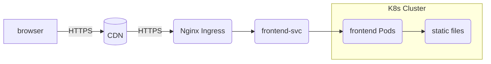

# 前端部署方案

> 本文档描述 **quant-platform** 前端 (Vue3 + Vite) 在本地开发、测试环境以及生产环境中的标准部署流程与最佳实践。

---

## 1. 架构概览

| 环境 | 目标 | 关键组件 |
|------|------|---------|
| 本地开发 | 快速迭代、热更新 | Vite Dev Server + Mock Service |
| 集成测试 (CI) | 自动化测试 / Storybook | Vitest + Playwright + chromatic |
| 预生产 | 与后端联调、灰度 | Docker Compose + Traefik |
| 生产 | 高可用、可观测 | K8s (k8s/), Nginx Ingress, CDN, Prometheus |

系统整体路径：



---

## 2. 本地开发

1. 安装依赖
   ```bash
   pnpm install
   ```
2. 启动开发服务器（自动代理后端 API 与 WS）
   ```bash
   pnpm dev
   ```
3. 关键参数
   | 变量 | 默认值 | 说明 |
   |-------|---------|------|
   | VITE_API_BASE_URL | http://localhost:8000/api/v1 | 后端 REST 接口 |
   | VITE_WS_URL | ws://localhost:8000/ws | 原生 WebSocket |

---

## 3. Docker 化打包

### 3.1 多阶段 Dockerfile

```dockerfile
FROM node:20-alpine AS build
WORKDIR /app
COPY . .
RUN pnpm install --frozen-lockfile \
    && pnpm build:prod

FROM nginx:1.25-alpine
COPY --from=build /app/dist /usr/share/nginx/html
COPY ./deploy/nginx.conf /etc/nginx/conf.d/default.conf
EXPOSE 80
CMD ["nginx", "-g", "daemon off;"]
```

### 3.2 镜像构建 & 运行
```bash
# 构建
docker build -t your-registry/quant-frontend:$(git rev-parse --short HEAD) .  # (示例)

# 本地运行
docker run -p 8080:80 your-registry/quant-frontend:xxxxxx  # (示例)
```

---

## 4. Docker Compose (测试 / 预生产)

```yaml
version: "3.9"
services:
  frontend:
    image: your-registry/quant-frontend:${TAG}  # (示例)
    environment:
      - TZ=Asia/Shanghai
    depends_on:
      - backend
    networks:
      - quant-net

  backend:
    image: your-registry/quant-backend:${TAG}  # (示例)
    networks:
      - quant-net

networks:
  quant-net:
```

> 通过 `.env` 文件注入 `TAG`，与 CI/CD 保持一致。

---

## 5. Kubernetes 生产部署

文件位置：`k8s/dev/`、`k8s/`。

### 5.1 前端 Deployment 片段
```yaml
apiVersion: apps/v1
kind: Deployment
metadata:
  name: quant-frontend
spec:
  replicas: 3
  selector:
    matchLabels:
      app: quant-frontend
  template:
    metadata:
      labels:
        app: quant-frontend
    spec:
      containers:
        - name: app
          image: your-registry/quant-frontend:{{ .Values.image.tag }}  # (示例)
          resources:
            limits:
              cpu: "250m"
              memory: "256Mi"
          ports:
            - containerPort: 80
```

### 5.2 Ingress TLS
```yaml
apiVersion: networking.k8s.io/v1
kind: Ingress
metadata:
  name: quant-frontend-ingress
  annotations:
    nginx.ingress.kubernetes.io/rewrite-target: /
    cert-manager.io/cluster-issuer: letsencrypt
spec:
  tls:
    - hosts:
        - frontend.quant.example.com  # (示例域名)
      secretName: quant-frontend-tls
  rules:
    - host: frontend.quant.example.com  # (示例域名)
      http:
        paths:
          - path: /
            pathType: Prefix
            backend:
              service:
                name: quant-frontend
                port:
                  number: 80
```

---

## 6. CI/CD 流程

1. **GitHub Actions** 触发 `push` / `PR`。
2. 运行 lint + test + build，生成产物缓存。
3. 构建并推送镜像到私有仓库。
4. 调用 ArgoCD / Helm 更新 K8s。
5. Sentry release + SourceMap 上传。

示例 Workflow：`.github/workflows/frontend-deploy.yml`。

---

## 7. 缓存与 CDN

- **Immutable 文件**：`assets/js|css|media` 带内容哈希，Cache-Control: `max-age=31536000, immutable`。
- **HTML**：短缓存 5 分钟，回源拉取最新。
- 推荐使用 Cloudflare / 阿里云 CDN，全局节点加速。

---

## 8. 回滚策略

1. 镜像保留最近 5 个 tag。
2. `kubectl rollout undo deployment/quant-frontend` 一键回滚。
3. 配合 Sentry Release 标记快速定位问题 commit。

---

## 9. FAQ

| 问题 | 解决方案 |
|------|---------|
| 首屏白屏 / 404 | 检查 Nginx `try_files`，确保所有路由重写到 `/index.html` |
| 静态资源 404 | 缓存刷新；检查哈希文件名与 HTML 引用是否一致 |
| 跨域 | 在 DevServer 代理 & Nginx `proxy_pass` 同时配置；确认 `VITE_API_BASE_URL` |

---

> ✅ 至此，前端部署方案说明完毕，可直接套用到 staging / prod 环境。 