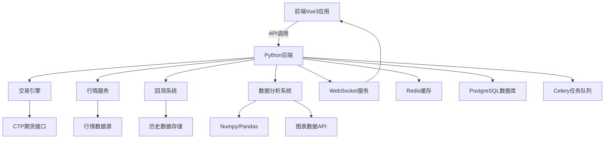

# 量化投资后端方案 - 项目概述

## 🚀 项目简介

基于 **Python + FastAPI** 的现代化量化投资后端平台，专为量化交易场景设计，提供**行情数据处理、实时交易执行、策略回测分析**等核心功能。采用异步架构，支持高并发实时数据处理，与前端 Vue3 应用完美配合。

## 🏗️ 整体架构设计



## 🧩 技术栈组成

| 组件分类 | 技术选择 | 版本要求 | 用途说明 |
|----------|----------|----------|----------|
| **核心框架** | FastAPI | 0.104+ | 高性能异步API服务 |
| **ASGI服务器** | Uvicorn/Gunicorn | 最新版 | 生产环境部署 |
| **数据处理** | Pandas + NumPy | 2.0+ / 1.24+ | 金融数据处理与分析 |
| **技术指标** | TA-Lib / ta | 0.4+ | 技术指标计算库 |
| **数据可视化** | 图表数据API | - | 为前端提供图表数据接口 |
| **期货交易** | ctp-python | 最新版 | CTP期货交易接口 |
| **数据存储** | PostgreSQL + TimescaleDB | 15+ | 时序数据存储 |
| **缓存系统** | Redis | 7.0+ | 实时数据缓存与消息队列 |
| **任务队列** | Celery | 5.3+ | 异步任务处理 |
| **ORM框架** | SQLAlchemy | 2.0+ | 异步数据库操作 |
| **数据验证** | Pydantic | 2.0+ | 数据模型与验证 |
| **WebSocket** | 原生WebSocket + FastAPI | 最新版 | 与前端原生WebSocket兼容 |
| **认证授权** | python-jose | 最新版 | JWT令牌处理 |
| **部署容器** | Docker + Nginx | 最新版 | 容器化部署与负载均衡 |

## 💡 核心特性

### 🏢 金融级功能特性
- **📊 实时行情处理**: CTP接口实时行情订阅，毫秒级数据推送
- **⚡ 高频交易支持**: 异步下单执行，支持多种订单类型
- **🎛️ 专业回测引擎**: Pandas向量化计算，支持复杂策略回测
- **📈 技术指标计算**: 50+内置技术指标，支持自定义指标
- **🔄 策略监控系统**: 实时策略运行状态监控与风险控制
- **📱 多市场支持**: 期货、股票、数字货币等多市场接入

### 🔧 技术优势特性
- **⚡ 异步高性能**: FastAPI异步架构，支持万级并发
- **🧩 微服务架构**: 服务分层设计，模块解耦，易于扩展
- **🔐 金融级安全**: JWT认证、API限流、交易权限控制
- **📊 智能监控**: Prometheus指标收集，Grafana可视化监控
- **🎨 图表数据接口**: 为前端ECharts提供结构化图表数据，后端专注数据处理

### 🛠️ 开发体验特性
- **📝 自动文档**: FastAPI自动生成OpenAPI文档
- **🔍 类型安全**: Pydantic模型确保数据类型安全
- **🧪 测试友好**: pytest异步测试支持
- **🚀 快速部署**: Docker容器化，一键部署

## 📊 性能指标

### 性能基准
```
API响应时间：< 50ms (P95)
WebSocket延迟：< 10ms
数据库查询：< 100ms (复杂查询)
并发连接数：10,000+
内存占用：< 500MB (单实例)
```

### 数据处理能力
```
实时行情处理：10,000+ symbols/second
历史数据回测：百万级K线数据
技术指标计算：毫秒级响应
报告生成：秒级图表输出
```

### 可用性指标
```
系统可用性：99.9%
故障恢复时间：< 30秒
数据一致性：强一致性保证
备份恢复：RTO < 1小时, RPO < 5分钟
```

## 🌟 核心亮点

### 1. 专业交易能力
- **CTP接口深度集成**: 支持期货实盘交易
- **多种订单类型**: 限价、市价、止损、条件单
- **实时风控**: 资金检查、持仓限制、止损保护
- **交易回报处理**: 异步订单状态更新

### 2. 高性能数据处理
- **向量化计算**: NumPy/Pandas高效数据处理
- **内存优化**: 数据分片加载，避免内存溢出
- **缓存策略**: Redis多级缓存，减少数据库压力
- **异步I/O**: 非阻塞数据库操作

### 3. 专业回测系统
- **策略引擎**: 支持自定义策略逻辑
- **绩效分析**: 夏普比率、最大回撤等专业指标
- **数据接口**: 提供回测结果的结构化数据接口
- **参数优化**: 网格搜索、遗传算法优化

### 4. 实时数据服务
- **WebSocket推送**: 原生WebSocket实时行情、交易回报推送
- **数据同步**: 与前端Vue3应用实时数据同步
- **消息队列**: Redis Pub/Sub消息分发
- **心跳机制**: 连接状态监控与自动重连

## 🔒 安全特性

### 数据安全
- **传输加密**: HTTPS/WSS加密传输
- **数据脱敏**: 敏感信息加密存储
- **访问控制**: 基于角色的权限管理
- **审计日志**: 完整的操作记录

### 交易安全
- **双重验证**: 交易密码+动态验证码
- **风控引擎**: 实时风险检查与限制
- **资金安全**: 银行级资金安全保障
- **异常监控**: 异常交易行为检测

## 🌍 部署架构

### 开发环境
```
Docker Compose本地开发栈：
- FastAPI应用容器
- PostgreSQL数据库容器  
- Redis缓存容器
- Celery Worker容器
```

### 生产环境
```
Kubernetes集群部署：
- 多副本API服务
- 数据库主从复制
- Redis集群
- Nginx负载均衡
- Prometheus监控
```

## 📈 扩展性设计

### 水平扩展
- **API服务**: 无状态设计，支持多实例部署
- **数据库**: 读写分离，分库分表
- **缓存**: Redis集群，数据分片
- **任务队列**: Celery多Worker并行处理

### 功能扩展
- **多市场接入**: 插件化交易接口设计
- **策略市场**: 第三方策略接入平台
- **算法交易**: 机器学习策略集成
- **风控升级**: 实时风险模型

## 🚀 快速开始预览

```bash
# 1. 克隆项目
git clone https://github.com/your-repo/quant-backend.git
cd quant-backend

# 2. 环境配置
cp .env.example .env
# 编辑 .env 配置文件

# 3. Docker启动
docker-compose up -d

# 4. 数据库初始化
docker-compose exec backend alembic upgrade head

# 5. 访问API文档
open http://localhost:8000/docs
```

## 📄 项目里程碑

### V1.0 MVP版本 (当前目标)
- ✅ 基础架构搭建
- ✅ CTP接口集成  
- ✅ 实时行情服务
- 🔄 交易执行引擎
- 🔄 回测分析系统
- ⏳ 风控管理模块

### V1.1 增强版本
- ⏳ 性能优化
- ⏳ 监控告警系统
- ⏳ 高级图表功能
- ⏳ 策略市场

### V2.0 专业版本
- ⏳ 机器学习集成
- ⏳ 多市场支持
- ⏳ 分布式架构
- ⏳ SaaS多租户

---

## 🔗 文档导航

### 📚 核心文档
1. **[后端项目结构](./07-后端项目结构.md)** - 完整目录结构与模块说明
2. **[后端技术架构](./08-后端技术架构.md)** - 系统架构与设计模式
3. **[后端核心模块](./09-后端核心模块.md)** - 主要业务模块实现
4. **[后端配置文件](./10-后端配置文件.md)** - 环境配置与部署设置

### 🚀 部署运维
5. **[后端部署方案](./11-后端部署方案.md)** - Docker、K8s、生产环境部署
6. **[后端监控运维](./12-后端监控运维.md)** - 日志、监控、告警系统

### 👨‍💻 开发指南
7. **[后端开发规范](./13-后端开发规范.md)** - 代码规范与最佳实践
8. **[后端测试方案](./14-后端测试方案.md)** - 单元测试与集成测试
9. **[后端接口文档](./15-后端接口文档.md)** - API接口详细说明

### 📋 项目管理
10. **[后端项目计划](./16-后端项目计划.md)** - 开发计划与里程碑
11. **[前后端协作](./17-前后端协作.md)** - 前后端协作规范
12. **[WebSocket文档](./18-WebSocket文档.md)** - 实时通信协议说明

---

## 🎯 快速导航

| 需求场景 | 推荐阅读 |
|---------|----------|
| 🏗️ **项目搭建** | [项目结构](./07-后端项目结构.md) → [配置文件](./10-后端配置文件.md) |
| 💻 **开发实现** | [技术架构](./08-后端技术架构.md) → [核心模块](./09-后端核心模块.md) |
| 🚀 **部署上线** | [部署方案](./11-后端部署方案.md) → [监控运维](./12-后端监控运维.md) |
| 📊 **API开发** | [接口文档](./15-后端接口文档.md) → [开发规范](./13-后端开发规范.md) |
| 👥 **团队协作** | [前后端协作](./17-前后端协作.md) → [项目计划](./16-后端项目计划.md) |

---
