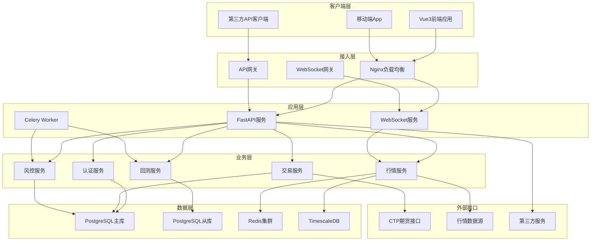

# 后端技术架构详细设计

## 🏗️ 系统架构总览

### 整体架构图



## 🎯 架构设计原则

### 1. 分层架构原则
- **接入层**: 统一入口，负载均衡，协议转换
- **应用层**: 业务逻辑处理，API服务提供
- **服务层**: 领域业务服务，核心功能实现
- **数据层**: 数据持久化，缓存管理

### 2. 微服务设计原则
- **单一职责**: 每个服务专注特定业务领域
- **服务自治**: 独立部署、独立扩展
- **接口标准**: 统一API规范，标准化通信
- **故障隔离**: 服务间故障不相互影响

### 3. 高可用设计原则
- **无单点故障**: 关键组件多实例部署
- **故障快速恢复**: 自动重启、健康检查
- **数据一致性**: 事务保证、最终一致性
- **降级机制**: 核心功能优先保障

## 🔧 技术选型详解

### 1. Web框架 - FastAPI

#### 选择理由
```python
# 高性能异步框架
from fastapi import FastAPI, BackgroundTasks
from fastapi.middleware.cors import CORSMiddleware
import asyncio

app = FastAPI(
    title="Quant Trading API",
    version="1.0.0",
    docs_url="/docs",
    redoc_url="/redoc"
)

# 自动API文档生成
@app.get("/market/kline/{symbol}")
async def get_kline(
    symbol: str,
    period: str = "1d",
    limit: int = 500
) -> List[KLineData]:
    """获取K线数据 - 自动生成OpenAPI文档"""
    return await market_service.get_kline_data(symbol, period, limit)
```

#### 技术优势
- **异步性能**: 基于ASGI，支持高并发
- **类型安全**: Pydantic数据验证
- **自动文档**: OpenAPI/Swagger自动生成
- **现代Python**: 支持Python 3.7+ 新特性

### 2. 数据处理 - NumPy + Pandas

#### 金融数据处理优化
```python
import numpy as np
import pandas as pd
from numba import jit

class TechnicalIndicators:
    @staticmethod
    @jit(nopython=True)
    def sma_numba(prices: np.ndarray, window: int) -> np.ndarray:
        """使用Numba加速的简单移动平均"""
        result = np.empty_like(prices)
        result[:window-1] = np.nan
        
        for i in range(window-1, len(prices)):
            result[i] = np.mean(prices[i-window+1:i+1])
        
        return result
    
    @staticmethod
    def calculate_indicators(df: pd.DataFrame) -> pd.DataFrame:
        """向量化技术指标计算"""
        # 移动平均线
        for period in [5, 10, 20, 60]:
            df[f'MA{period}'] = df['close'].rolling(period).mean()
        
        # MACD
        exp12 = df['close'].ewm(span=12).mean()
        exp26 = df['close'].ewm(span=26).mean()
        df['MACD'] = exp12 - exp26
        df['Signal'] = df['MACD'].ewm(span=9).mean()
        df['Histogram'] = df['MACD'] - df['Signal']
        
        # RSI
        delta = df['close'].diff()
        gain = delta.where(delta > 0, 0).rolling(14).mean()
        loss = (-delta.where(delta < 0, 0)).rolling(14).mean()
        rs = gain / loss
        df['RSI'] = 100 - (100 / (1 + rs))
        
        return df
```

#### 性能优化策略
```python
# 内存优化
def optimize_dataframe(df: pd.DataFrame) -> pd.DataFrame:
    """优化DataFrame内存使用"""
    for col in df.columns:
        if df[col].dtype == 'float64':
            df[col] = pd.to_numeric(df[col], downcast='float')
        elif df[col].dtype == 'int64':
            df[col] = pd.to_numeric(df[col], downcast='integer')
    
    return df

# 分块处理大数据
def process_large_dataset(file_path: str, chunk_size: int = 10000):
    """分块处理大型数据集"""
    results = []
    
    for chunk in pd.read_csv(file_path, chunksize=chunk_size):
        # 处理每个数据块
        processed_chunk = TechnicalIndicators.calculate_indicators(chunk)
        results.append(processed_chunk)
    
    return pd.concat(results, ignore_index=True)
```

### 3. 数据存储架构

#### PostgreSQL + TimescaleDB
```sql
-- 时序数据表设计
CREATE TABLE market_data (
    id BIGSERIAL PRIMARY KEY,
    symbol VARCHAR(32) NOT NULL,
    timestamp TIMESTAMPTZ NOT NULL,
    open DECIMAL(18,4) NOT NULL,
    high DECIMAL(18,4) NOT NULL,
    low DECIMAL(18,4) NOT NULL,
    close DECIMAL(18,4) NOT NULL,
    volume BIGINT NOT NULL,
    created_at TIMESTAMPTZ DEFAULT NOW()
);

-- 创建TimescaleDB超表
SELECT create_hypertable('market_data', 'timestamp');

-- 创建索引优化查询
CREATE INDEX idx_market_data_symbol_time ON market_data (symbol, timestamp DESC);
CREATE INDEX idx_market_data_symbol ON market_data USING HASH (symbol);

-- 数据保留策略
SELECT add_retention_policy('market_data', INTERVAL '2 years');
```

#### Redis缓存策略
```python
import redis
import json
from typing import Optional, Any
import pickle

class CacheManager:
    def __init__(self, redis_url: str):
        self.redis = redis.from_url(redis_url, decode_responses=True)
        self.binary_redis = redis.from_url(redis_url, decode_responses=False)
    
    async def get_market_data(self, symbol: str, period: str) -> Optional[pd.DataFrame]:
        """获取缓存的行情数据"""
        cache_key = f"market_data:{symbol}:{period}"
        
        try:
            cached_data = self.binary_redis.get(cache_key)
            if cached_data:
                return pickle.loads(cached_data)
        except Exception as e:
            logger.error(f"Cache get error: {e}")
        
        return None
    
    async def set_market_data(self, symbol: str, period: str, data: pd.DataFrame, expire: int = 300):
        """缓存行情数据"""
        cache_key = f"market_data:{symbol}:{period}"
        
        try:
            serialized_data = pickle.dumps(data)
            self.binary_redis.setex(cache_key, expire, serialized_data)
        except Exception as e:
            logger.error(f"Cache set error: {e}")
    
    async def publish_realtime_data(self, channel: str, data: dict):
        """发布实时数据"""
        try:
            self.redis.publish(channel, json.dumps(data))
        except Exception as e:
            logger.error(f"Publish error: {e}")
```

### 4. CTP接口集成架构

#### CTP封装设计
```python
import asyncio
from typing import Dict, Callable, Optional
from dataclasses import dataclass
from enum import Enum

@dataclass
class CTPConfig:
    broker_id: str
    user_id: str
    password: str
    md_address: str
    td_address: str

class OrderSide(Enum):
    BUY = "0"
    SELL = "1"

class CTPWrapper:
    def __init__(self, config: CTPConfig):
        self.config = config
        self.md_api = None
        self.td_api = None
        self.callbacks: Dict[str, Callable] = {}
        self.order_refs: Dict[str, str] = {}
        
    async def initialize(self):
        """异步初始化CTP连接"""
        await asyncio.gather(
            self._init_market_data(),
            self._init_trading()
        )
    
    async def _init_market_data(self):
        """初始化行情接口"""
        self.md_api = MdApi(self)
        self.md_api.RegisterFront(self.config.md_address)
        self.md_api.Init()
        
        # 等待连接成功
        await self._wait_for_connection('md')
    
    async def _init_trading(self):
        """初始化交易接口"""
        self.td_api = TraderApi(self)
        self.td_api.RegisterFront(self.config.td_address)
        self.td_api.SubscribePrivateTopic(0)
        self.td_api.SubscribePublicTopic(0)
        self.td_api.Init()
        
        # 等待连接成功
        await self._wait_for_connection('td')
    
    def register_callback(self, event: str, callback: Callable):
        """注册事件回调"""
        self.callbacks[event] = callback
    
    async def place_order(self, symbol: str, side: OrderSide, price: float, volume: int) -> str:
        """异步下单"""
        order_ref = self._generate_order_ref()
        
        # 构造下单请求
        order_request = {
            'InstrumentID': symbol,
            'Direction': side.value,
            'LimitPrice': price,
            'VolumeTotalOriginal': volume,
            'OrderRef': order_ref,
            'CombOffsetFlag': '0',  # 开仓
            'CombHedgeFlag': '1',   # 投机
            'TimeCondition': '3',   # 当日有效
            'VolumeCondition': '1', # 任何数量
            'MinVolume': 1,
            'ContingentCondition': '1',  # 立即
            'ForceCloseReason': '0',     # 非强平
            'IsAutoSuspend': 0,
            'UserForceClose': 0
        }
        
        # 提交订单
        self.td_api.ReqOrderInsert(order_request)
        self.order_refs[order_ref] = symbol
        
        return order_ref
    
    def _generate_order_ref(self) -> str:
        """生成唯一订单引用"""
        import time
        return f"{self.config.user_id}_{int(time.time() * 1000000) % 1000000}"
    
    # CTP回调处理
    def OnFrontConnected(self):
        """连接成功回调"""
        if 'connected' in self.callbacks:
            asyncio.create_task(self.callbacks['connected']())
    
    def OnRtnDepthMarketData(self, data):
        """行情数据回调"""
        if 'market_data' in self.callbacks:
            asyncio.create_task(self.callbacks['market_data'](data))
    
    def OnRtnOrder(self, data):
        """订单状态回调"""
        if 'order_update' in self.callbacks:
            asyncio.create_task(self.callbacks['order_update'](data))
    
    def OnRtnTrade(self, data):
        """成交回报回调"""
        if 'trade_update' in self.callbacks:
            asyncio.create_task(self.callbacks['trade_update'](data))
```

### 5. 异步任务架构 - Celery

#### Celery配置优化
```python
from celery import Celery
from kombu import Queue
import os

# Celery应用配置
celery_app = Celery("quant-backend")

# 配置优化
celery_app.conf.update(
    # 序列化
    task_serializer='json',
    accept_content=['json'],
    result_serializer='json',
    
    # 时区
    timezone='Asia/Shanghai',
    enable_utc=True,
    
    # 任务路由
    task_routes={
        'app.tasks.backtest_tasks.*': {'queue': 'backtest'},
        'app.tasks.data_tasks.*': {'queue': 'data'},
        'app.tasks.report_tasks.*': {'queue': 'report'},
    },
    
    # 队列配置
    task_queues=(
        Queue('backtest', routing_key='backtest', priority=5),
        Queue('data', routing_key='data', priority=8),
        Queue('report', routing_key='report', priority=3),
        Queue('default', routing_key='default', priority=1),
    ),
    
    # 任务执行配置
    task_acks_late=True,
    worker_prefetch_multiplier=1,
    task_reject_on_worker_lost=True,
    
    # 结果后端
    result_backend=os.getenv('CELERY_RESULT_BACKEND'),
    result_expires=3600,
    
    # 监控
    worker_send_task_events=True,
    task_send_sent_event=True,
)

# 任务装饰器
@celery_app.task(bind=True, max_retries=3)
def backtest_task(self, backtest_id: str, params: dict):
    """回测任务"""
    try:
        # 更新任务状态
        self.update_state(
            state='PROGRESS',
            meta={'progress': 0, 'status': 'Starting backtest...'}
        )
        
        # 执行回测逻辑
        result = run_backtest_logic(params, progress_callback=self.update_state)
        
        return {
            'status': 'SUCCESS',
            'result': result,
            'backtest_id': backtest_id
        }
        
    except Exception as exc:
        # 重试机制
        if self.request.retries < self.max_retries:
            raise self.retry(countdown=60, exc=exc)
        
        # 失败处理
        self.update_state(
            state='FAILURE',
            meta={'error': str(exc), 'backtest_id': backtest_id}
        )
        raise
```

### 4. WebSocket实时通信层

#### 架构设计
```python
# app/websocket/manager.py
from fastapi import WebSocket
from typing import Dict, List, Set
import json
import asyncio
from datetime import datetime

class WebSocketManager:
    def __init__(self):
        # 连接管理
        self.active_connections: Dict[str, WebSocket] = {}
        self.user_connections: Dict[int, Set[str]] = {}
        self.subscriptions: Dict[str, Set[str]] = {}  # 订阅管理
        
    async def connect(self, websocket: WebSocket, connection_id: str):
        """建立WebSocket连接"""
        await websocket.accept()
        self.active_connections[connection_id] = websocket
        
    async def disconnect(self, connection_id: str):
        """断开WebSocket连接"""
        if connection_id in self.active_connections:
            del self.active_connections[connection_id]
            
        # 清理用户连接映射
        for user_id, connections in self.user_connections.items():
            connections.discard(connection_id)
            
        # 清理订阅
        for channel, subscribers in self.subscriptions.items():
            subscribers.discard(connection_id)
    
    async def authenticate_connection(self, connection_id: str, user_id: int):
        """认证WebSocket连接"""
        if user_id not in self.user_connections:
            self.user_connections[user_id] = set()
        self.user_connections[user_id].add(connection_id)
    
    async def subscribe(self, connection_id: str, channel: str):
        """订阅频道"""
        if channel not in self.subscriptions:
            self.subscriptions[channel] = set()
        self.subscriptions[channel].add(connection_id)
    
    async def unsubscribe(self, connection_id: str, channel: str):
        """取消订阅"""
        if channel in self.subscriptions:
            self.subscriptions[channel].discard(connection_id)
    
    async def send_personal_message(self, user_id: int, message: dict):
        """发送个人消息"""
        if user_id in self.user_connections:
            connections = self.user_connections[user_id]
            for connection_id in connections.copy():
                websocket = self.active_connections.get(connection_id)
                if websocket:
                    try:
                        await websocket.send_text(json.dumps(message))
                    except Exception:
                        await self.disconnect(connection_id)
    
    async def broadcast_to_channel(self, channel: str, message: dict):
        """向频道广播消息"""
        if channel in self.subscriptions:
            subscribers = self.subscriptions[channel].copy()
            for connection_id in subscribers:
                websocket = self.active_connections.get(connection_id)
                if websocket:
                    try:
                        await websocket.send_text(json.dumps(message))
                    except Exception:
                        await self.disconnect(connection_id)

# 全局WebSocket管理器实例
websocket_manager = WebSocketManager()
```

#### 消息处理器
```python
# app/websocket/handlers/auth.py
from app.websocket.manager import websocket_manager
from app.core.security import verify_token
import json

async def handle_auth_message(connection_id: str, message: dict):
    """处理认证消息"""
    try:
        token = message.get('data', {}).get('token')
        if not token:
            await send_error(connection_id, "缺少认证令牌")
            return
            
        # 验证JWT令牌
        payload = verify_token(token)
        user_id = payload.get('user_id')
        
        # 认证成功
        await websocket_manager.authenticate_connection(connection_id, user_id)
        
        # 发送认证成功响应
        response = {
            "type": "auth_response",
            "data": {
                "status": "success",
                "user_id": user_id,
                "permissions": payload.get('permissions', [])
            },
            "timestamp": datetime.utcnow().isoformat()
        }
        
        websocket = websocket_manager.active_connections.get(connection_id)
        if websocket:
            await websocket.send_text(json.dumps(response))
            
    except Exception as e:
        await send_error(connection_id, f"认证失败: {str(e)}")

async def send_error(connection_id: str, error_message: str):
    """发送错误消息"""
    error_response = {
        "type": "error",
        "data": {"message": error_message},
        "timestamp": datetime.utcnow().isoformat()
    }
    
    websocket = websocket_manager.active_connections.get(connection_id)
    if websocket:
        await websocket.send_text(json.dumps(error_response))
```

#### WebSocket路由
```python
# app/api/v1/websocket.py
from fastapi import APIRouter, WebSocket, WebSocketDisconnect
from app.websocket.manager import websocket_manager
from app.websocket.handlers import handle_message
import uuid
import json

router = APIRouter()

@router.websocket("/ws")
async def websocket_endpoint(websocket: WebSocket):
    connection_id = str(uuid.uuid4())
    
    try:
        await websocket_manager.connect(websocket, connection_id)
        
        while True:
            # 接收消息
            data = await websocket.receive_text()
            message = json.loads(data)
            
            # 处理消息
            await handle_message(connection_id, message)
            
    except WebSocketDisconnect:
        await websocket_manager.disconnect(connection_id)
    except Exception as e:
        print(f"WebSocket错误: {e}")
        await websocket_manager.disconnect(connection_id)
```

### 7. 安全架构设计

#### JWT认证系统
```python
from jose import JWTError, jwt
from passlib.context import CryptContext
from datetime import datetime, timedelta
from fastapi import HTTPException, status, Depends
from fastapi.security import OAuth2PasswordBearer

class SecurityManager:
    def __init__(self, secret_key: str, algorithm: str = "HS256"):
        self.secret_key = secret_key
        self.algorithm = algorithm
        self.pwd_context = CryptContext(schemes=["bcrypt"], deprecated="auto")
        self.oauth2_scheme = OAuth2PasswordBearer(tokenUrl="token")
    
    def verify_password(self, plain_password: str, hashed_password: str) -> bool:
        """验证密码"""
        return self.pwd_context.verify(plain_password, hashed_password)
    
    def get_password_hash(self, password: str) -> str:
        """生成密码哈希"""
        return self.pwd_context.hash(password)
    
    def create_access_token(self, data: dict, expires_delta: Optional[timedelta] = None):
        """创建访问令牌"""
        to_encode = data.copy()
        
        if expires_delta:
            expire = datetime.utcnow() + expires_delta
        else:
            expire = datetime.utcnow() + timedelta(minutes=15)
        
        to_encode.update({"exp": expire})
        encoded_jwt = jwt.encode(to_encode, self.secret_key, algorithm=self.algorithm)
        
        return encoded_jwt
    
    async def get_current_user(self, token: str = Depends(oauth2_scheme)):
        """获取当前用户"""
        credentials_exception = HTTPException(
            status_code=status.HTTP_401_UNAUTHORIZED,
            detail="Could not validate credentials",
            headers={"WWW-Authenticate": "Bearer"},
        )
        
        try:
            payload = jwt.decode(token, self.secret_key, algorithms=[self.algorithm])
            username: str = payload.get("sub")
            if username is None:
                raise credentials_exception
                
            # 验证token是否在黑名单中
            if await self.is_token_blacklisted(token):
                raise credentials_exception
                
        except JWTError:
            raise credentials_exception
        
        # 从数据库获取用户信息
        user = await get_user_by_username(username)
        if user is None:
            raise credentials_exception
            
        return user
    
    async def is_token_blacklisted(self, token: str) -> bool:
        """检查token是否在黑名单中"""
        # 从Redis检查token黑名单
        return await redis_client.sismember("token_blacklist", token)
    
    async def blacklist_token(self, token: str):
        """将token加入黑名单"""
        # 解析token获取过期时间
        try:
            payload = jwt.decode(token, self.secret_key, algorithms=[self.algorithm])
            exp = payload.get("exp")
            if exp:
                # 计算剩余时间
                expire_time = datetime.fromtimestamp(exp) - datetime.utcnow()
                if expire_time.total_seconds() > 0:
                    await redis_client.sadd("token_blacklist", token)
                    await redis_client.expire("token_blacklist", int(expire_time.total_seconds()))
        except JWTError:
            pass
```

#### API限流与防护
```python
from fastapi import Request, HTTPException
from starlette.middleware.base import BaseHTTPMiddleware
import time
import asyncio

class RateLimitMiddleware(BaseHTTPMiddleware):
    def __init__(self, app, calls: int = 100, period: int = 60):
        super().__init__(app)
        self.calls = calls
        self.period = period
        self.clients = {}
    
    async def dispatch(self, request: Request, call_next):
        client_ip = request.client.host
        current_time = time.time()
        
        # 清理过期记录
        if client_ip in self.clients:
            self.clients[client_ip] = [
                timestamp for timestamp in self.clients[client_ip]
                if current_time - timestamp < self.period
            ]
        else:
            self.clients[client_ip] = []
        
        # 检查限流
        if len(self.clients[client_ip]) >= self.calls:
            raise HTTPException(
                status_code=429,
                detail="Rate limit exceeded"
            )
        
        # 记录请求时间
        self.clients[client_ip].append(current_time)
        
        response = await call_next(request)
        return response

# 风控中间件
class RiskControlMiddleware(BaseHTTPMiddleware):
    def __init__(self, app):
        super().__init__(app)
        self.suspicious_patterns = [
            r'/api/v1/trading/order',  # 交易接口
            r'/api/v1/account/transfer',  # 资金转账
        ]
    
    async def dispatch(self, request: Request, call_next):
        # 检查可疑请求模式
        path = str(request.url.path)
        
        for pattern in self.suspicious_patterns:
            if re.match(pattern, path):
                # 记录可疑请求
                await self.log_suspicious_request(request)
                
                # 额外验证
                if not await self.verify_request_legitimacy(request):
                    raise HTTPException(
                        status_code=403,
                        detail="Request blocked by risk control"
                    )
        
        response = await call_next(request)
        return response
    
    async def log_suspicious_request(self, request: Request):
        """记录可疑请求"""
        log_data = {
            'ip': request.client.host,
            'path': str(request.url.path),
            'method': request.method,
            'user_agent': request.headers.get('user-agent'),
            'timestamp': datetime.utcnow().isoformat()
        }
        
        # 异步记录到数据库或日志系统
        await log_to_security_system(log_data)
    
    async def verify_request_legitimacy(self, request: Request) -> bool:
        """验证请求合法性"""
        # 实现具体的风控逻辑
        # 例如：检查用户行为模式、IP地理位置等
        return True
```

## 🚀 性能优化策略

### 1. 数据库优化
```python
# 连接池配置
from sqlalchemy.pool import QueuePool

engine = create_async_engine(
    DATABASE_URL,
    poolclass=QueuePool,
    pool_size=20,
    max_overflow=0,
    pool_pre_ping=True,
    pool_recycle=3600,
    echo=False
)

# 查询优化
class OptimizedQueries:
    @staticmethod
    async def get_kline_data_optimized(
        db: AsyncSession,
        symbol: str,
        start_time: datetime,
        end_time: datetime,
        limit: int = 1000
    ):
        """优化的K线数据查询"""
        query = select(MarketData).where(
            and_(
                MarketData.symbol == symbol,
                MarketData.timestamp >= start_time,
                MarketData.timestamp <= end_time
            )
        ).order_by(
            MarketData.timestamp.desc()
        ).limit(limit)
        
        result = await db.execute(query)
        return result.scalars().all()
```

### 2. 缓存优化
```python
from functools import wraps
import asyncio

def cache_result(expire_time: int = 300):
    """缓存装饰器"""
    def decorator(func):
        @wraps(func)
        async def wrapper(*args, **kwargs):
            # 生成缓存键
            cache_key = f"{func.__name__}:{hash(str(args) + str(kwargs))}"
            
            # 尝试从缓存获取
            cached_result = await redis_client.get(cache_key)
            if cached_result:
                return json.loads(cached_result)
            
            # 执行函数
            result = await func(*args, **kwargs)
            
            # 缓存结果
            await redis_client.setex(
                cache_key, 
                expire_time, 
                json.dumps(result, default=str)
            )
            
            return result
        return wrapper
    return decorator

# 使用示例
@cache_result(expire_time=60)
async def get_market_summary(symbol: str):
    """获取市场概要（缓存1分钟）"""
    return await market_service.get_summary(symbol)
```

### 3. 异步优化
```python
import asyncio
from concurrent.futures import ThreadPoolExecutor

class AsyncOptimizer:
    def __init__(self):
        self.executor = ThreadPoolExecutor(max_workers=10)
    
    async def parallel_data_processing(self, symbols: List[str]):
        """并行处理多个股票数据"""
        tasks = []
        
        for symbol in symbols:
            task = asyncio.create_task(
                self.process_symbol_data(symbol)
            )
            tasks.append(task)
        
        results = await asyncio.gather(*tasks, return_exceptions=True)
        return results
    
    async def cpu_intensive_task(self, data):
        """CPU密集型任务异步处理"""
        loop = asyncio.get_event_loop()
        
        # 在线程池中执行CPU密集型任务
        result = await loop.run_in_executor(
            self.executor,
            self.heavy_calculation,
            data
        )
        
        return result
    
    def heavy_calculation(self, data):
        """重计算任务"""
        # NumPy向量化计算
        return np.complex_calculation(data)
```

