# 后端核心模块详细实现

## 🎯 模块架构概览

```mermaid
graph TD
    A[API路由层] --> B[服务层Service]
    B --> C[数据访问层CRUD]
    C --> D[数据模型层Model]
    
    B --> E[CTP交易接口]
    B --> F[Redis缓存]
    B --> G[Celery任务队列]
    
    subgraph "核心业务模块"
        H[认证模块]
        I[行情模块]
        J[交易模块]
        K[回测模块]
        L[风控模块]
        M[报告模块]
    end
    
    B --> H
    B --> I
    B --> J
    B --> K
    B --> L
    B --> M
```



## 🔐 认证模块 (Authentication)

### 用户认证服务
```python
# app/services/auth_service.py
from datetime import datetime, timedelta
from typing import Optional
from sqlalchemy.ext.asyncio import AsyncSession
from fastapi import HTTPException, status
from app.core.security import SecurityManager
from app.db.crud.user import user_crud
from app.schemas.auth import UserLogin, UserRegister, TokenResponse

class AuthService:
    def __init__(self, security_manager: SecurityManager):
        self.security = security_manager
    
    async def register_user(
        self, 
        db: AsyncSession, 
        user_data: UserRegister
    ) -> TokenResponse:
        """用户注册"""
        # 检查用户是否已存在
        existing_user = await user_crud.get_by_email(db, user_data.email)
        if existing_user:
            raise HTTPException(
                status_code=status.HTTP_400_BAD_REQUEST,
                detail="Email already registered"
            )
        
        # 创建新用户
        hashed_password = self.security.get_password_hash(user_data.password)
        user_create = {
            "username": user_data.username,
            "email": user_data.email,
            "hashed_password": hashed_password,
            "is_active": True
        }
        
        new_user = await user_crud.create(db, obj_in=user_create)
        
        # 生成访问令牌
        access_token = self.security.create_access_token(
            data={"sub": new_user.username, "user_id": new_user.id}
        )
        
        return TokenResponse(
            access_token=access_token,
            token_type="bearer",
            user_id=new_user.id,
            username=new_user.username
        )
    
    async def authenticate_user(
        self, 
        db: AsyncSession, 
        login_data: UserLogin
    ) -> TokenResponse:
        """用户登录认证"""
        # 验证用户凭据
        user = await user_crud.get_by_email(db, login_data.email)
        if not user or not self.security.verify_password(
            login_data.password, user.hashed_password
        ):
            raise HTTPException(
                status_code=status.HTTP_401_UNAUTHORIZED,
                detail="Incorrect email or password"
            )
        
        if not user.is_active:
            raise HTTPException(
                status_code=status.HTTP_400_BAD_REQUEST,
                detail="Inactive user"
            )
        
        # 更新最后登录时间
        await user_crud.update(
            db, db_obj=user, obj_in={"last_login": datetime.utcnow()}
        )
        
        # 生成访问令牌
        access_token = self.security.create_access_token(
            data={"sub": user.username, "user_id": user.id}
        )
        
        return TokenResponse(
            access_token=access_token,
            token_type="bearer",
            user_id=user.id,
            username=user.username
        )
    
    async def refresh_token(
        self, 
        db: AsyncSession, 
        current_user_id: int
    ) -> TokenResponse:
        """刷新访问令牌"""
        user = await user_crud.get(db, id=current_user_id)
        if not user or not user.is_active:
            raise HTTPException(
                status_code=status.HTTP_401_UNAUTHORIZED,
                detail="Invalid user"
            )
        
        access_token = self.security.create_access_token(
            data={"sub": user.username, "user_id": user.id}
        )
        
        return TokenResponse(
            access_token=access_token,
            token_type="bearer",
            user_id=user.id,
            username=user.username
        )
    
    async def logout_user(self, token: str):
        """用户登出（将token加入黑名单）"""
        await self.security.blacklist_token(token)
```

### 权限控制系统
```python
# app/core/permissions.py
from enum import Enum
from typing import List, Dict
from functools import wraps
from fastapi import HTTPException, status, Depends

class Permission(Enum):
    READ_MARKET_DATA = "read:market_data"
    PLACE_ORDER = "place:order"
    VIEW_ACCOUNT = "view:account"
    MANAGE_STRATEGY = "manage:strategy"
    RUN_BACKTEST = "run:backtest"
    ADMIN_ACCESS = "admin:access"

class Role(Enum):
    VIEWER = "viewer"
    TRADER = "trader"
    ANALYST = "analyst"
    ADMIN = "admin"

# 角色权限映射
ROLE_PERMISSIONS: Dict[Role, List[Permission]] = {
    Role.VIEWER: [
        Permission.READ_MARKET_DATA,
        Permission.VIEW_ACCOUNT
    ],
    Role.TRADER: [
        Permission.READ_MARKET_DATA,
        Permission.PLACE_ORDER,
        Permission.VIEW_ACCOUNT
    ],
    Role.ANALYST: [
        Permission.READ_MARKET_DATA,
        Permission.VIEW_ACCOUNT,
        Permission.MANAGE_STRATEGY,
        Permission.RUN_BACKTEST
    ],
    Role.ADMIN: list(Permission)  # 所有权限
}

def require_permission(permission: Permission):
    """权限检查装饰器"""
    def decorator(func):
        @wraps(func)
        async def wrapper(*args, **kwargs):
            # 从依赖注入获取当前用户
            current_user = kwargs.get('current_user')
            
            if not current_user:
                raise HTTPException(
                    status_code=status.HTTP_401_UNAUTHORIZED,
                    detail="Authentication required"
                )
            
            # 检查用户权限
            user_role = Role(current_user.role)
            user_permissions = ROLE_PERMISSIONS.get(user_role, [])
            
            if permission not in user_permissions:
                raise HTTPException(
                    status_code=status.HTTP_403_FORBIDDEN,
                    detail="Insufficient permissions"
                )
            
            return await func(*args, **kwargs)
        return wrapper
    return decorator
```

## 📊 行情模块 (Market Data)

### 行情数据服务
```python
# app/services/market_service.py
import pandas as pd
import numpy as np
from typing import List, Optional, Dict
from datetime import datetime, timedelta
from sqlalchemy.ext.asyncio import AsyncSession
from app.core.ctp_wrapper import CTPService
from app.utils.cache_utils import CacheManager
from app.schemas.market import KLineData, QuoteData, MarketSummary

class MarketService:
    def __init__(self, ctp_service: CTPService, cache_manager: CacheManager):
        self.ctp = ctp_service
        self.cache = cache_manager
        self.subscribed_symbols = set()
        self.realtime_quotes: Dict[str, QuoteData] = {}
    
    async def get_realtime_quote(self, symbol: str) -> Optional[QuoteData]:
        """获取实时行情"""
        # 先从内存缓存获取
        if symbol in self.realtime_quotes:
            quote = self.realtime_quotes[symbol]
            # 检查数据是否过期（超过5秒）
            if (datetime.now() - quote.timestamp).seconds < 5:
                return quote
        
        # 从Redis缓存获取
        cached_quote = await self.cache.get(f"quote:{symbol}")
        if cached_quote:
            return QuoteData.parse_raw(cached_quote)
        
        return None
    
    async def subscribe_market_data(self, symbols: List[str]) -> bool:
        """订阅实时行情"""
        new_symbols = [s for s in symbols if s not in self.subscribed_symbols]
        
        if new_symbols:
            try:
                await self.ctp.subscribe_market_data(new_symbols)
                self.subscribed_symbols.update(new_symbols)
                return True
            except Exception as e:
                logger.error(f"Failed to subscribe market data: {e}")
                return False
        
        return True
    
    async def get_kline_data(
        self, 
        db: AsyncSession,
        symbol: str, 
        period: str, 
        limit: int = 500,
        start_time: Optional[datetime] = None,
        end_time: Optional[datetime] = None
    ) -> List[KLineData]:
        """获取K线数据"""
        # 生成缓存键
        cache_key = f"kline:{symbol}:{period}:{limit}"
        
        # 尝试从缓存获取
        cached_data = await self.cache.get_market_data(symbol, period)
        if cached_data is not None and len(cached_data) >= limit:
            return self._dataframe_to_kline(cached_data.tail(limit))
        
        # 从数据库查询
        if not start_time:
            start_time = datetime.now() - timedelta(days=365)
        if not end_time:
            end_time = datetime.now()
        
        query_result = await self._query_kline_from_db(
            db, symbol, period, start_time, end_time, limit
        )
        
        if query_result.empty:
            # 如果数据库没有数据，尝试从外部API获取
            query_result = await self._fetch_external_kline_data(
                symbol, period, limit
            )
        
        # 缓存数据
        if not query_result.empty:
            await self.cache.set_market_data(symbol, period, query_result)
        
        return self._dataframe_to_kline(query_result)
    
    async def _query_kline_from_db(
        self,
        db: AsyncSession,
        symbol: str,
        period: str,
        start_time: datetime,
        end_time: datetime,
        limit: int
    ) -> pd.DataFrame:
        """从数据库查询K线数据"""
        from app.db.crud.market_data import market_data_crud
        
        records = await market_data_crud.get_kline_data(
            db, symbol, start_time, end_time, limit
        )
        
        if not records:
            return pd.DataFrame()
        
        # 转换为DataFrame
        data = []
        for record in records:
            data.append({
                'timestamp': record.timestamp,
                'open': float(record.open),
                'high': float(record.high),
                'low': float(record.low),
                'close': float(record.close),
                'volume': record.volume
            })
        
        df = pd.DataFrame(data)
        df.set_index('timestamp', inplace=True)
        
        # 根据周期重采样
        if period != '1min':
            df = self._resample_kline_data(df, period)
        
        return df
    
    def _resample_kline_data(self, df: pd.DataFrame, period: str) -> pd.DataFrame:
        """重采样K线数据"""
        period_map = {
            '5min': '5T',
            '15min': '15T',
            '30min': '30T',
            '1h': '1H',
            '4h': '4H',
            '1d': '1D',
            '1w': '1W',
            '1M': '1M'
        }
        
        freq = period_map.get(period, '1D')
        
        resampled = df.resample(freq).agg({
            'open': 'first',
            'high': 'max',
            'low': 'min',
            'close': 'last',
            'volume': 'sum'
        }).dropna()
        
        return resampled
    
    def _dataframe_to_kline(self, df: pd.DataFrame) -> List[KLineData]:
        """DataFrame转换为KLineData列表"""
        kline_data = []
        
        for timestamp, row in df.iterrows():
            kline_data.append(KLineData(
                timestamp=timestamp,
                open=row['open'],
                high=row['high'],
                low=row['low'],
                close=row['close'],
                volume=row['volume']
            ))
        
        return kline_data
    
    async def calculate_market_summary(
        self, 
        db: AsyncSession,
        symbols: List[str]
    ) -> Dict[str, MarketSummary]:
        """计算市场概要"""
        summaries = {}
        
        for symbol in symbols:
            # 获取最近交易日数据
            kline_data = await self.get_kline_data(
                db, symbol, '1d', limit=2
            )
            
            if len(kline_data) >= 2:
                current = kline_data[0]
                previous = kline_data[1]
                
                change = current.close - previous.close
                change_percent = (change / previous.close) * 100
                
                summaries[symbol] = MarketSummary(
                    symbol=symbol,
                    current_price=current.close,
                    change=change,
                    change_percent=change_percent,
                    volume=current.volume,
                    high_24h=current.high,
                    low_24h=current.low
                )
        
        return summaries
    
    async def on_market_data_received(self, data: dict):
        """处理CTP行情数据回调"""
        symbol = data.get('InstrumentID')
        if not symbol:
            return
        
        # 构造行情数据
        quote = QuoteData(
            symbol=symbol,
            last_price=data.get('LastPrice', 0),
            bid_price=data.get('BidPrice1', 0),
            ask_price=data.get('AskPrice1', 0),
            bid_volume=data.get('BidVolume1', 0),
            ask_volume=data.get('AskVolume1', 0),
            volume=data.get('Volume', 0),
            timestamp=datetime.now()
        )
        
        # 更新内存缓存
        self.realtime_quotes[symbol] = quote
        
        # 更新Redis缓存
        await self.cache.set(
            f"quote:{symbol}", 
            quote.json(), 
            expire=10
        )
        
        # 推送到WebSocket
        await self._broadcast_quote_update(quote)
    
    async def _broadcast_quote_update(self, quote: QuoteData):
        """广播行情更新"""
        from app.api.websocket import connection_manager
        
        message = {
            'type': 'quote_update',
            'data': quote.dict()
        }
        
        await connection_manager.broadcast_to_channel(
            message, f"market:{quote.symbol}"
        )
```

### 技术指标计算
```python
# app/utils/technical_indicators.py
import numpy as np
import pandas as pd
from typing import Dict, Any
from numba import jit

class TechnicalIndicators:
    """技术指标计算类"""
    
    @staticmethod
    def add_all_indicators(df: pd.DataFrame) -> pd.DataFrame:
        """添加所有技术指标"""
        df = TechnicalIndicators.add_moving_averages(df)
        df = TechnicalIndicators.add_macd(df)
        df = TechnicalIndicators.add_rsi(df)
        df = TechnicalIndicators.add_bollinger_bands(df)
        df = TechnicalIndicators.add_stochastic(df)
        return df
    
    @staticmethod
    def add_moving_averages(df: pd.DataFrame) -> pd.DataFrame:
        """添加移动平均线"""
        periods = [5, 10, 20, 50, 200]
        
        for period in periods:
            df[f'MA{period}'] = df['close'].rolling(window=period).mean()
            df[f'EMA{period}'] = df['close'].ewm(span=period).mean()
        
        return df
    
    @staticmethod
    def add_macd(df: pd.DataFrame, fast=12, slow=26, signal=9) -> pd.DataFrame:
        """添加MACD指标"""
        exp1 = df['close'].ewm(span=fast, adjust=False).mean()
        exp2 = df['close'].ewm(span=slow, adjust=False).mean()
        
        df['MACD'] = exp1 - exp2
        df['MACD_Signal'] = df['MACD'].ewm(span=signal, adjust=False).mean()
        df['MACD_Histogram'] = df['MACD'] - df['MACD_Signal']
        
        return df
    
    @staticmethod
    def add_rsi(df: pd.DataFrame, period=14) -> pd.DataFrame:
        """添加RSI指标"""
        delta = df['close'].diff()
        gain = (delta.where(delta > 0, 0)).rolling(window=period).mean()
        loss = (-delta.where(delta < 0, 0)).rolling(window=period).mean()
        
        rs = gain / loss
        df['RSI'] = 100 - (100 / (1 + rs))
        
        return df
    
    @staticmethod
    def add_bollinger_bands(df: pd.DataFrame, period=20, std=2) -> pd.DataFrame:
        """添加布林带指标"""
        df['BB_Middle'] = df['close'].rolling(window=period).mean()
        bb_std = df['close'].rolling(window=period).std()
        
        df['BB_Upper'] = df['BB_Middle'] + (bb_std * std)
        df['BB_Lower'] = df['BB_Middle'] - (bb_std * std)
        df['BB_Width'] = df['BB_Upper'] - df['BB_Lower']
        df['BB_Position'] = (df['close'] - df['BB_Lower']) / df['BB_Width']
        
        return df
    
    @staticmethod
    def add_stochastic(df: pd.DataFrame, k_period=14, d_period=3) -> pd.DataFrame:
        """添加随机指标"""
        low_min = df['low'].rolling(window=k_period).min()
        high_max = df['high'].rolling(window=k_period).max()
        
        df['%K'] = 100 * ((df['close'] - low_min) / (high_max - low_min))
        df['%D'] = df['%K'].rolling(window=d_period).mean()
        
        return df
    
    @staticmethod
    @jit(nopython=True)
    def calculate_sma_fast(prices: np.ndarray, window: int) -> np.ndarray:
        """使用Numba加速的SMA计算"""
        n = len(prices)
        result = np.empty(n)
        result[:window-1] = np.nan
        
        for i in range(window-1, n):
            result[i] = np.mean(prices[i-window+1:i+1])
        
        return result
    
    @staticmethod
    def calculate_custom_indicator(
        df: pd.DataFrame, 
        indicator_config: Dict[str, Any]
    ) -> pd.Series:
        """计算自定义指标"""
        indicator_type = indicator_config.get('type')
        params = indicator_config.get('params', {})
        
        if indicator_type == 'custom_ma':
            period = params.get('period', 20)
            source = params.get('source', 'close')
            return df[source].rolling(window=period).mean()
        
        elif indicator_type == 'price_channel':
            period = params.get('period', 20)
            high_channel = df['high'].rolling(window=period).max()
            low_channel = df['low'].rolling(window=period).min()
            return (high_channel + low_channel) / 2
        
        elif indicator_type == 'volatility':
            period = params.get('period', 20)
            returns = df['close'].pct_change()
            return returns.rolling(window=period).std() * np.sqrt(252)
        
        else:
            raise ValueError(f"Unknown indicator type: {indicator_type}")
```

## 💼 交易模块 (Trading)

### 交易服务实现
```python
# app/services/trading_service.py
from typing import List, Optional, Dict
from decimal import Decimal
from datetime import datetime
from sqlalchemy.ext.asyncio import AsyncSession
from app.core.ctp_wrapper import CTPService
from app.services.risk_service import RiskService
from app.schemas.trading import OrderRequest, OrderResponse, Position, AccountInfo
from app.db.crud.order import order_crud
from app.db.crud.position import position_crud

class TradingService:
    def __init__(self, ctp_service: CTPService, risk_service: RiskService):
        self.ctp = ctp_service
        self.risk = risk_service
        self.pending_orders: Dict[str, OrderRequest] = {}
    
    async def place_order(
        self, 
        db: AsyncSession,
        user_id: int,
        order_request: OrderRequest
    ) -> OrderResponse:
        """下单"""
        # 风险检查
        risk_result = await self.risk.check_order_risk(
            db, user_id, order_request
        )
        
        if not risk_result.passed:
            raise HTTPException(
                status_code=400,
                detail=f"Risk check failed: {risk_result.reason}"
            )
        
        # 创建订单记录
        order_data = {
            "user_id": user_id,
            "symbol": order_request.symbol,
            "side": order_request.side,
            "order_type": order_request.order_type,
            "price": order_request.price,
            "quantity": order_request.quantity,
            "status": "PENDING",
            "created_at": datetime.utcnow()
        }
        
        db_order = await order_crud.create(db, obj_in=order_data)
        
        try:
            # 提交到CTP
            ctp_order_ref = await self.ctp.place_order(
                symbol=order_request.symbol,
                side=order_request.side,
                price=float(order_request.price),
                volume=order_request.quantity
            )
            
            # 更新订单状态
            await order_crud.update(
                db, 
                db_obj=db_order, 
                obj_in={"ctp_order_ref": ctp_order_ref, "status": "SUBMITTED"}
            )
            
            # 缓存待处理订单
            self.pending_orders[ctp_order_ref] = order_request
            
            return OrderResponse(
                id=str(db_order.id),
                symbol=order_request.symbol,
                side=order_request.side,
                order_type=order_request.order_type,
                price=order_request.price,
                quantity=order_request.quantity,
                status="SUBMITTED",
                created_at=db_order.created_at,
                ctp_order_ref=ctp_order_ref
            )
            
        except Exception as e:
            # 更新订单为失败状态
            await order_crud.update(
                db, 
                db_obj=db_order, 
                obj_in={"status": "FAILED", "error_message": str(e)}
            )
            
            raise HTTPException(
                status_code=500,
                detail=f"Failed to place order: {str(e)}"
            )
    
    async def cancel_order(
        self, 
        db: AsyncSession,
        user_id: int,
        order_id: str
    ) -> bool:
        """撤单"""
        # 查找订单
        db_order = await order_crud.get(db, id=int(order_id))
        
        if not db_order or db_order.user_id != user_id:
            raise HTTPException(
                status_code=404,
                detail="Order not found"
            )
        
        if db_order.status not in ["PENDING", "SUBMITTED", "PARTIAL_FILLED"]:
            raise HTTPException(
                status_code=400,
                detail="Order cannot be cancelled"
            )
        
        try:
            # 提交撤单请求到CTP
            success = await self.ctp.cancel_order(db_order.ctp_order_ref)
            
            if success:
                await order_crud.update(
                    db, 
                    db_obj=db_order, 
                    obj_in={"status": "CANCELLED"}
                )
            
            return success
            
        except Exception as e:
            logger.error(f"Failed to cancel order {order_id}: {e}")
            return False
    
    async def get_positions(
        self, 
        db: AsyncSession,
        user_id: int
    ) -> List[Position]:
        """获取持仓"""
        db_positions = await position_crud.get_by_user(db, user_id=user_id)
        
        positions = []
        for db_pos in db_positions:
            # 计算持仓盈亏
            current_price = await self._get_current_price(db_pos.symbol)
            unrealized_pnl = self._calculate_unrealized_pnl(
                db_pos, current_price
            )
            
            positions.append(Position(
                symbol=db_pos.symbol,
                quantity=db_pos.quantity,
                avg_price=db_pos.avg_price,
                current_price=current_price,
                unrealized_pnl=unrealized_pnl,
                realized_pnl=db_pos.realized_pnl,
                updated_at=db_pos.updated_at
            ))
        
        return positions
    
    async def get_account_info(
        self, 
        db: AsyncSession,
        user_id: int
    ) -> AccountInfo:
        """获取账户信息"""
        # 从CTP查询账户信息
        ctp_account = await self.ctp.query_account()
        
        # 计算持仓市值
        positions = await self.get_positions(db, user_id)
        position_value = sum(
            pos.quantity * pos.current_price for pos in positions
        )
        
        # 计算总资产
        total_assets = ctp_account.get('Balance', 0) + position_value
        
        return AccountInfo(
            user_id=user_id,
            balance=Decimal(str(ctp_account.get('Balance', 0))),
            available=Decimal(str(ctp_account.get('Available', 0))),
            frozen=Decimal(str(ctp_account.get('FrozenMargin', 0))),
            position_value=Decimal(str(position_value)),
            total_assets=Decimal(str(total_assets)),
            updated_at=datetime.utcnow()
        )
    
    async def on_order_update(self, ctp_data: dict):
        """处理CTP订单状态更新"""
        order_ref = ctp_data.get('OrderRef')
        if not order_ref:
            return
        
        # 更新数据库订单状态
        async with AsyncSession() as db:
            db_order = await order_crud.get_by_ctp_ref(db, order_ref)
            if db_order:
                status_map = {
                    '0': 'SUBMITTED',
                    '1': 'PARTIAL_FILLED',
                    '2': 'FILLED',
                    '5': 'CANCELLED',
                    '6': 'REJECTED'
                }
                
                new_status = status_map.get(
                    ctp_data.get('OrderStatus'), 'UNKNOWN'
                )
                
                await order_crud.update(
                    db, 
                    db_obj=db_order, 
                    obj_in={"status": new_status}
                )
    
    async def on_trade_update(self, ctp_data: dict):
        """处理CTP成交回报"""
        order_ref = ctp_data.get('OrderRef')
        if not order_ref:
            return
        
        async with AsyncSession() as db:
            # 更新持仓
            await self._update_position_on_trade(db, ctp_data)
            
            # 记录成交记录
            await self._record_trade(db, ctp_data)
    
    async def _update_position_on_trade(self, db: AsyncSession, trade_data: dict):
        """根据成交更新持仓"""
        symbol = trade_data.get('InstrumentID')
        direction = trade_data.get('Direction')  # '0'买 '1'卖
        volume = trade_data.get('Volume', 0)
        price = trade_data.get('Price', 0)
        
        # 查找或创建持仓记录
        position = await position_crud.get_by_symbol(db, symbol=symbol)
        
        if not position:
            # 创建新持仓
            position_data = {
                "symbol": symbol,
                "quantity": volume if direction == '0' else -volume,
                "avg_price": Decimal(str(price)),
                "realized_pnl": Decimal('0')
            }
            await position_crud.create(db, obj_in=position_data)
        else:
            # 更新现有持仓
            if direction == '0':  # 买入
                new_quantity = position.quantity + volume
                new_avg_price = (
                    (position.avg_price * position.quantity + Decimal(str(price)) * volume) 
                    / new_quantity
                )
            else:  # 卖出
                new_quantity = position.quantity - volume
                # 计算已实现盈亏
                realized_pnl = (Decimal(str(price)) - position.avg_price) * volume
                new_avg_price = position.avg_price
            
            await position_crud.update(
                db,
                db_obj=position,
                obj_in={
                    "quantity": new_quantity,
                    "avg_price": new_avg_price,
                    "realized_pnl": position.realized_pnl + realized_pnl if direction == '1' else position.realized_pnl
                }
            )
    
    def _calculate_unrealized_pnl(
        self, 
        position, 
        current_price: float
    ) -> Decimal:
        """计算未实现盈亏"""
        if position.quantity == 0:
            return Decimal('0')
        
        return (Decimal(str(current_price)) - position.avg_price) * position.quantity
    
    async def _get_current_price(self, symbol: str) -> float:
        """获取当前价格"""
        from app.services.market_service import market_service
        
        quote = await market_service.get_realtime_quote(symbol)
        return quote.last_price if quote else 0.0
```

