# 后端部署方案详细指南

## 🚀 部署架构概览

```mermaid
graph TB
    subgraph "负载均衡层"
        LB[Nginx/HAProxy]
        CDN[CDN服务]
    end
    
    subgraph "应用层"
        API1[FastAPI实例1]
        API2[FastAPI实例2]
        API3[FastAPI实例3]
        WS[WebSocket服务]
    end
    
    subgraph "任务队列层"
        CW1[Celery Worker 1]
        CW2[Celery Worker 2]
        CB[Celery Beat]
    end
    
    subgraph "数据层"
        PG_M[PostgreSQL主库]
        PG_S[PostgreSQL从库]
        REDIS_C[Redis集群]
        TS[TimescaleDB]
    end
    
    subgraph "监控层"
        PROM[Prometheus]
        GRAF[Grafana]
        ALERT[AlertManager]
    end
    
    CDN --> LB
    LB --> API1
    LB --> API2
    LB --> API3
    LB --> WS
    
    API1 --> PG_M
    API2 --> PG_S
    API3 --> PG_S
    
    API1 --> REDIS_C
    API2 --> REDIS_C
    API3 --> REDIS_C
    
    CW1 --> PG_M
    CW2 --> PG_M
    CB --> REDIS_C
    
    PROM --> GRAF
    PROM --> ALERT
```



## 🐳 Docker部署方案

### 1. 生产环境Docker配置

#### docker-compose.prod.yml
```yaml
version: '3.8'

services:
  # 后端API服务 (多实例)
  backend-1:
    build: 
      context: .
      dockerfile: Dockerfile.prod
    environment:
      - ENV=production
      - INSTANCE_ID=backend-1
      - DATABASE_URL=${DATABASE_URL}
      - REDIS_URL=${REDIS_URL}
      - SECRET_KEY=${SECRET_KEY}
    deploy:
      resources:
        limits:
          cpus: '1.0'
          memory: 1G
        reservations:
          cpus: '0.5'
          memory: 512M
    networks:
      - quant-network
    restart: unless-stopped
    healthcheck:
      test: ["CMD", "curl", "-f", "http://localhost:8000/health"]
      interval: 30s
      timeout: 10s
      retries: 3
      start_period: 40s

  backend-2:
    build: 
      context: .
      dockerfile: Dockerfile.prod
    environment:
      - ENV=production
      - INSTANCE_ID=backend-2
      - DATABASE_URL=${DATABASE_URL}
      - REDIS_URL=${REDIS_URL}
      - SECRET_KEY=${SECRET_KEY}
    deploy:
      resources:
        limits:
          cpus: '1.0'
          memory: 1G
        reservations:
          cpus: '0.5'
          memory: 512M
    networks:
      - quant-network
    restart: unless-stopped

  # WebSocket服务
  websocket:
    build: 
      context: .
      dockerfile: Dockerfile.websocket
    environment:
      - ENV=production
      - REDIS_URL=${REDIS_URL}
    ports:
      - "8001:8001"
    networks:
      - quant-network
    restart: unless-stopped

  # Celery Workers (多实例)
  celery-worker-backtest:
    build: 
      context: .
      dockerfile: Dockerfile.worker
    command: celery -A app.tasks.celery_app worker --loglevel=info --queues=backtest --concurrency=2
    environment:
      - ENV=production
      - DATABASE_URL=${DATABASE_URL}
      - REDIS_URL=${REDIS_URL}
    deploy:
      resources:
        limits:
          cpus: '2.0'
          memory: 2G
    networks:
      - quant-network
    restart: unless-stopped

  celery-worker-data:
    build: 
      context: .
      dockerfile: Dockerfile.worker
    command: celery -A app.tasks.celery_app worker --loglevel=info --queues=data --concurrency=4
    environment:
      - ENV=production
      - DATABASE_URL=${DATABASE_URL}
      - REDIS_URL=${REDIS_URL}
    networks:
      - quant-network
    restart: unless-stopped

  celery-beat:
    build: 
      context: .
      dockerfile: Dockerfile.worker
    command: celery -A app.tasks.celery_app beat --loglevel=info
    environment:
      - ENV=production
      - REDIS_URL=${REDIS_URL}
    volumes:
      - celery_beat_data:/app/celerybeat-schedule
    networks:
      - quant-network
    restart: unless-stopped

  # 数据库服务
  postgres-master:
    image: timescale/timescaledb:latest-pg15
    environment:
      - POSTGRES_DB=${POSTGRES_DB}
      - POSTGRES_USER=${POSTGRES_USER}
      - POSTGRES_PASSWORD=${POSTGRES_PASSWORD}
      - POSTGRES_REPLICATION_MODE=master
      - POSTGRES_REPLICATION_USER=replicator
      - POSTGRES_REPLICATION_PASSWORD=${POSTGRES_REPLICATION_PASSWORD}
    volumes:
      - postgres_master_data:/var/lib/postgresql/data
      - ./scripts/postgres/master.conf:/etc/postgresql/postgresql.conf
      - ./scripts/postgres/pg_hba.conf:/etc/postgresql/pg_hba.conf
    ports:
      - "5432:5432"
    networks:
      - quant-network
    restart: unless-stopped

  postgres-slave:
    image: timescale/timescaledb:latest-pg15
    environment:
      - POSTGRES_REPLICATION_MODE=slave
      - POSTGRES_REPLICATION_USER=replicator
      - POSTGRES_REPLICATION_PASSWORD=${POSTGRES_REPLICATION_PASSWORD}
      - POSTGRES_MASTER_HOST=postgres-master
      - POSTGRES_MASTER_PORT=5432
    volumes:
      - postgres_slave_data:/var/lib/postgresql/data
    networks:
      - quant-network
    restart: unless-stopped
    depends_on:
      - postgres-master

  # Redis集群
  redis-master:
    image: redis:7-alpine
    command: redis-server /etc/redis/redis.conf --requirepass ${REDIS_PASSWORD}
    volumes:
      - redis_master_data:/data
      - ./config/redis/master.conf:/etc/redis/redis.conf
    ports:
      - "6379:6379"
    networks:
      - quant-network
    restart: unless-stopped

  redis-slave:
    image: redis:7-alpine
    command: redis-server /etc/redis/redis.conf --requirepass ${REDIS_PASSWORD} --slaveof redis-master 6379
    volumes:
      - redis_slave_data:/data
      - ./config/redis/slave.conf:/etc/redis/redis.conf
    networks:
      - quant-network
    restart: unless-stopped
    depends_on:
      - redis-master

  # Nginx负载均衡
  nginx:
    image: nginx:alpine
    ports:
      - "80:80"
      - "443:443"
    volumes:
      - ./nginx/nginx.prod.conf:/etc/nginx/nginx.conf
      - ./nginx/ssl:/etc/nginx/ssl
      - nginx_logs:/var/log/nginx
    depends_on:
      - backend-1
      - backend-2
    networks:
      - quant-network
    restart: unless-stopped

  # 监控服务
  prometheus:
    image: prom/prometheus:latest
    ports:
      - "9090:9090"
    volumes:
      - ./monitoring/prometheus/prometheus.yml:/etc/prometheus/prometheus.yml
      - ./monitoring/prometheus/rules:/etc/prometheus/rules
      - prometheus_data:/prometheus
    command:
      - '--config.file=/etc/prometheus/prometheus.yml'
      - '--storage.tsdb.path=/prometheus'
      - '--web.console.libraries=/etc/prometheus/console_libraries'
      - '--web.console.templates=/etc/prometheus/consoles'
      - '--storage.tsdb.retention.time=200h'
      - '--web.enable-lifecycle'
    networks:
      - quant-network
    restart: unless-stopped

  grafana:
    image: grafana/grafana:latest
    ports:
      - "3000:3000"
    environment:
      - GF_SECURITY_ADMIN_USER=${GRAFANA_USER}
      - GF_SECURITY_ADMIN_PASSWORD=${GRAFANA_PASSWORD}
    volumes:
      - grafana_data:/var/lib/grafana
      - ./monitoring/grafana/provisioning:/etc/grafana/provisioning
    networks:
      - quant-network
    restart: unless-stopped

volumes:
  postgres_master_data:
  postgres_slave_data:
  redis_master_data:
  redis_slave_data:
  celery_beat_data:
  prometheus_data:
  grafana_data:
  nginx_logs:

networks:
  quant-network:
    driver: bridge
    ipam:
      config:
        - subnet: 172.20.0.0/16
```

### 2. 生产环境Dockerfile

#### Dockerfile.prod
```dockerfile
# 多阶段构建 - 生产环境优化
FROM python:3.9-slim as builder

# 设置构建参数
ARG BUILD_ENV=production

# 安装构建依赖
RUN apt-get update && apt-get install -y \
    build-essential \
    libpq-dev \
    gcc \
    g++ \
    && rm -rf /var/lib/apt/lists/*

# 设置工作目录
WORKDIR /app

# 复制requirements文件
COPY requirements.txt requirements-prod.txt ./

# 安装Python依赖
RUN pip install --no-cache-dir --user -r requirements-prod.txt

# 生产镜像
FROM python:3.9-slim

# 设置标签
LABEL maintainer="your-team@company.com"
LABEL version="1.0.0"
LABEL description="Quant Trading Backend API"

# 设置环境变量
ENV PYTHONUNBUFFERED=1
ENV PYTHONDONTWRITEBYTECODE=1
ENV PYTHONPATH=/app
ENV PATH="/root/.local/bin:$PATH"

# 创建应用用户
RUN groupadd -r appuser && useradd -r -g appuser -s /bin/bash appuser

# 安装运行时依赖
RUN apt-get update && apt-get install -y \
    libpq5 \
    curl \
    && rm -rf /var/lib/apt/lists/* \
    && apt-get clean

# 从builder阶段复制Python包
COPY --from=builder /root/.local /root/.local

# 设置工作目录
WORKDIR /app

# 复制应用代码
COPY . .

# 创建必要目录并设置权限
RUN mkdir -p data/logs data/reports data/uploads \
    && chown -R appuser:appuser /app \
    && chmod +x scripts/entrypoint.sh

# 切换到应用用户
USER appuser

# 暴露端口
EXPOSE 8000

# 健康检查
HEALTHCHECK --interval=30s --timeout=30s --start-period=5s --retries=3 \
    CMD curl -f http://localhost:8000/health || exit 1

# 启动脚本
ENTRYPOINT ["./scripts/entrypoint.sh"]
CMD ["uvicorn", "app.main:app", "--host", "0.0.0.0", "--port", "8000", "--workers", "4"]
```

#### scripts/entrypoint.sh
```bash
#!/bin/bash
set -e

# 等待数据库启动
echo "Waiting for database..."
while ! nc -z $DATABASE_HOST $DATABASE_PORT; do
  sleep 0.1
done
echo "Database started"

# 等待Redis启动
echo "Waiting for Redis..."
while ! nc -z $REDIS_HOST $REDIS_PORT; do
  sleep 0.1
done
echo "Redis started"

# 运行数据库迁移
echo "Running database migrations..."
alembic upgrade head

# 创建初始数据
echo "Creating initial data..."
python scripts/create_initial_data.py

# 启动应用
echo "Starting application..."
exec "$@"
```

## ☸️ Kubernetes部署方案

### 1. Namespace配置

#### k8s/namespace.yaml
```yaml
apiVersion: v1
kind: Namespace
metadata:
  name: quant-trading
  labels:
    name: quant-trading
    environment: production
```

### 2. ConfigMap配置

#### k8s/configmap.yaml
```yaml
apiVersion: v1
kind: ConfigMap
metadata:
  name: quant-backend-config
  namespace: quant-trading
data:
  ENV: "production"
  LOG_LEVEL: "INFO"
  WORKERS: "4"
  CORS_ORIGINS: "https://yourdomain.com,https://app.yourdomain.com"
  
  # Redis配置
  REDIS_DB: "0"
  REDIS_MAX_CONNECTIONS: "100"
  
  # Celery配置
  CELERY_TASK_SERIALIZER: "json"
  CELERY_RESULT_SERIALIZER: "json"
  
  # 应用配置
  DEFAULT_PAGE_SIZE: "20"
  MAX_PAGE_SIZE: "100"
---
apiVersion: v1
kind: ConfigMap
metadata:
  name: nginx-config
  namespace: quant-trading
data:
  nginx.conf: |
    upstream backend {
        server quant-backend-service:8000;
    }
    
    server {
        listen 80;
        server_name api.yourdomain.com;
        
        location / {
            proxy_pass http://backend;
            proxy_set_header Host $host;
            proxy_set_header X-Real-IP $remote_addr;
            proxy_set_header X-Forwarded-For $proxy_add_x_forwarded_for;
            proxy_set_header X-Forwarded-Proto $scheme;
        }
        
        location /ws {
            proxy_pass http://backend;
            proxy_http_version 1.1;
            proxy_set_header Upgrade $http_upgrade;
            proxy_set_header Connection "upgrade";
            proxy_set_header Host $host;
        }
    }
```

### 3. Secret配置

#### k8s/secret.yaml
```yaml
apiVersion: v1
kind: Secret
metadata:
  name: quant-backend-secrets
  namespace: quant-trading
type: Opaque
data:
  # Base64编码的敏感信息
  DATABASE_URL: <base64-encoded-database-url>
  REDIS_URL: <base64-encoded-redis-url>
  SECRET_KEY: <base64-encoded-secret-key>
  JWT_SECRET_KEY: <base64-encoded-jwt-secret>
  CTP_USER_ID: <base64-encoded-ctp-user-id>
  CTP_PASSWORD: <base64-encoded-ctp-password>
  POSTGRES_PASSWORD: <base64-encoded-postgres-password>
  REDIS_PASSWORD: <base64-encoded-redis-password>
```

### 4. Deployment配置

#### k8s/deployment.yaml
```yaml
apiVersion: apps/v1
kind: Deployment
metadata:
  name: quant-backend
  namespace: quant-trading
  labels:
    app: quant-backend
spec:
  replicas: 3
  selector:
    matchLabels:
      app: quant-backend
  template:
    metadata:
      labels:
        app: quant-backend
    spec:
      containers:
      - name: backend
        image: your-registry/quant-backend:latest
        ports:
        - containerPort: 8000
        env:
        - name: ENV
          valueFrom:
            configMapKeyRef:
              name: quant-backend-config
              key: ENV
        - name: DATABASE_URL
          valueFrom:
            secretKeyRef:
              name: quant-backend-secrets
              key: DATABASE_URL
        - name: REDIS_URL
          valueFrom:
            secretKeyRef:
              name: quant-backend-secrets
              key: REDIS_URL
        - name: SECRET_KEY
          valueFrom:
            secretKeyRef:
              name: quant-backend-secrets
              key: SECRET_KEY
        resources:
          requests:
            memory: "512Mi"
            cpu: "500m"
          limits:
            memory: "1Gi"
            cpu: "1000m"
        livenessProbe:
          httpGet:
            path: /health
            port: 8000
          initialDelaySeconds: 30
          periodSeconds: 10
        readinessProbe:
          httpGet:
            path: /ready
            port: 8000
          initialDelaySeconds: 5
          periodSeconds: 5
        volumeMounts:
        - name: app-logs
          mountPath: /app/data/logs
      volumes:
      - name: app-logs
        persistentVolumeClaim:
          claimName: quant-backend-logs-pvc
---
apiVersion: apps/v1
kind: Deployment
metadata:
  name: celery-worker
  namespace: quant-trading
  labels:
    app: celery-worker
spec:
  replicas: 2
  selector:
    matchLabels:
      app: celery-worker
  template:
    metadata:
      labels:
        app: celery-worker
    spec:
      containers:
      - name: worker
        image: your-registry/quant-backend:latest
        command: ["celery"]
        args: ["-A", "app.tasks.celery_app", "worker", "--loglevel=info", "--concurrency=4"]
        env:
        - name: ENV
          value: "production"
        - name: DATABASE_URL
          valueFrom:
            secretKeyRef:
              name: quant-backend-secrets
              key: DATABASE_URL
        - name: REDIS_URL
          valueFrom:
            secretKeyRef:
              name: quant-backend-secrets
              key: REDIS_URL
        resources:
          requests:
            memory: "1Gi"
            cpu: "500m"
          limits:
            memory: "2Gi"
            cpu: "1000m"
```

### 5. Service配置

#### k8s/service.yaml
```yaml
apiVersion: v1
kind: Service
metadata:
  name: quant-backend-service
  namespace: quant-trading
  labels:
    app: quant-backend
spec:
  selector:
    app: quant-backend
  ports:
  - name: http
    port: 8000
    targetPort: 8000
    protocol: TCP
  type: ClusterIP
---
apiVersion: v1
kind: Service
metadata:
  name: postgres-service
  namespace: quant-trading
spec:
  selector:
    app: postgres
  ports:
  - port: 5432
    targetPort: 5432
  type: ClusterIP
---
apiVersion: v1
kind: Service
metadata:
  name: redis-service
  namespace: quant-trading
spec:
  selector:
    app: redis
  ports:
  - port: 6379
    targetPort: 6379
  type: ClusterIP
```

### 6. Ingress配置

#### k8s/ingress.yaml
```yaml
apiVersion: networking.k8s.io/v1
kind: Ingress
metadata:
  name: quant-backend-ingress
  namespace: quant-trading
  annotations:
    kubernetes.io/ingress.class: nginx
    cert-manager.io/cluster-issuer: letsencrypt-prod
    nginx.ingress.kubernetes.io/ssl-redirect: "true"
    nginx.ingress.kubernetes.io/proxy-body-size: "50m"
    nginx.ingress.kubernetes.io/rate-limit: "100"
    nginx.ingress.kubernetes.io/rate-limit-window: "1m"
spec:
  tls:
  - hosts:
    - api.yourdomain.com
    secretName: quant-backend-tls
  rules:
  - host: api.yourdomain.com
    http:
      paths:
      - path: /
        pathType: Prefix
        backend:
          service:
            name: quant-backend-service
            port:
              number: 8000
```

### 7. HPA自动扩缩容

#### k8s/hpa.yaml
```yaml
apiVersion: autoscaling/v2
kind: HorizontalPodAutoscaler
metadata:
  name: quant-backend-hpa
  namespace: quant-trading
spec:
  scaleTargetRef:
    apiVersion: apps/v1
    kind: Deployment
    name: quant-backend
  minReplicas: 3
  maxReplicas: 10
  metrics:
  - type: Resource
    resource:
      name: cpu
      target:
        type: Utilization
        averageUtilization: 70
  - type: Resource
    resource:
      name: memory
      target:
        type: Utilization
        averageUtilization: 80
  behavior:
    scaleDown:
      stabilizationWindowSeconds: 300
      policies:
      - type: Percent
        value: 10
        periodSeconds: 60
    scaleUp:
      stabilizationWindowSeconds: 60
      policies:
      - type: Percent
        value: 50
        periodSeconds: 60
```

## 🔧 Nginx负载均衡配置

### nginx/nginx.prod.conf
```nginx
user nginx;
worker_processes auto;
error_log /var/log/nginx/error.log warn;
pid /var/run/nginx.pid;

events {
    worker_connections 1024;
    use epoll;
    multi_accept on;
}

http {
    include /etc/nginx/mime.types;
    default_type application/octet-stream;

    # 日志格式
    log_format main '$remote_addr - $remote_user [$time_local] "$request" '
                    '$status $body_bytes_sent "$http_referer" '
                    '"$http_user_agent" "$http_x_forwarded_for" '
                    '$request_time $upstream_response_time';

    access_log /var/log/nginx/access.log main;

    # 基础配置
    sendfile on;
    tcp_nopush on;
    tcp_nodelay on;
    keepalive_timeout 65;
    types_hash_max_size 2048;
    client_max_body_size 50M;

    # Gzip压缩
    gzip on;
    gzip_vary on;
    gzip_min_length 1024;
    gzip_proxied any;
    gzip_comp_level 6;
    gzip_types
        text/plain
        text/css
        text/xml
        text/javascript
        application/json
        application/javascript
        application/xml+rss
        application/atom+xml;

    # 限流配置
    limit_req_zone $binary_remote_addr zone=api:10m rate=10r/s;
    limit_req_zone $binary_remote_addr zone=trading:10m rate=5r/s;

    # 后端服务器组
    upstream backend_api {
        least_conn;
        server backend-1:8000 max_fails=3 fail_timeout=30s;
        server backend-2:8000 max_fails=3 fail_timeout=30s;
        keepalive 32;
    }

    upstream websocket_servers {
        ip_hash;
        server websocket:8001 max_fails=3 fail_timeout=30s;
        keepalive 32;
    }

    # HTTP重定向到HTTPS
    server {
        listen 80;
        server_name api.yourdomain.com;
        return 301 https://$server_name$request_uri;
    }

    # HTTPS主服务器
    server {
        listen 443 ssl http2;
        server_name api.yourdomain.com;

        # SSL配置
        ssl_certificate /etc/nginx/ssl/fullchain.pem;
        ssl_certificate_key /etc/nginx/ssl/privkey.pem;
        ssl_protocols TLSv1.2 TLSv1.3;
        ssl_ciphers ECDHE-RSA-AES256-GCM-SHA512:DHE-RSA-AES256-GCM-SHA512:ECDHE-RSA-AES256-GCM-SHA384:DHE-RSA-AES256-GCM-SHA384;
        ssl_prefer_server_ciphers off;
        ssl_session_cache shared:SSL:10m;
        ssl_session_timeout 10m;

        # 安全头
        add_header X-Frame-Options DENY;
        add_header X-Content-Type-Options nosniff;
        add_header X-XSS-Protection "1; mode=block";
        add_header Strict-Transport-Security "max-age=31536000; includeSubDomains" always;

        # API路由
        location /api/ {
            limit_req zone=api burst=20 nodelay;
            
            proxy_pass http://backend_api;
            proxy_set_header Host $host;
            proxy_set_header X-Real-IP $remote_addr;
            proxy_set_header X-Forwarded-For $proxy_add_x_forwarded_for;
            proxy_set_header X-Forwarded-Proto $scheme;
            
            # 超时配置
            proxy_connect_timeout 5s;
            proxy_send_timeout 60s;
            proxy_read_timeout 60s;
            
            # 缓冲配置
            proxy_buffering on;
            proxy_buffer_size 4k;
            proxy_buffers 8 4k;
        }

        # 交易API特殊限流
        location /api/v1/trading/ {
            limit_req zone=trading burst=10 nodelay;
            
            proxy_pass http://backend_api;
            proxy_set_header Host $host;
            proxy_set_header X-Real-IP $remote_addr;
            proxy_set_header X-Forwarded-For $proxy_add_x_forwarded_for;
            proxy_set_header X-Forwarded-Proto $scheme;
        }

        # WebSocket路由
        location /ws/ {
            proxy_pass http://websocket_servers;
            proxy_http_version 1.1;
            proxy_set_header Upgrade $http_upgrade;
            proxy_set_header Connection "upgrade";
            proxy_set_header Host $host;
            proxy_set_header X-Real-IP $remote_addr;
            proxy_set_header X-Forwarded-For $proxy_add_x_forwarded_for;
            proxy_set_header X-Forwarded-Proto $scheme;
            
            # WebSocket特殊配置
            proxy_read_timeout 86400;
            proxy_send_timeout 86400;
        }

        # 健康检查
        location /health {
            proxy_pass http://backend_api;
            access_log off;
        }

        # 静态文件
        location /static/ {
            alias /app/static/;
            expires 1y;
            add_header Cache-Control "public, immutable";
        }

        # 报告文件下载
        location /reports/ {
            alias /app/data/reports/;
            add_header Content-Disposition "attachment";
        }
    }
}
```

## 📊 监控配置

### monitoring/prometheus/prometheus.yml
```yaml
global:
  scrape_interval: 15s
  evaluation_interval: 15s

rule_files:
  - "/etc/prometheus/rules/*.yml"

alerting:
  alertmanagers:
    - static_configs:
        - targets:
          - alertmanager:9093

scrape_configs:
  # Prometheus自身监控
  - job_name: 'prometheus'
    static_configs:
      - targets: ['localhost:9090']

  # 后端API监控
  - job_name: 'quant-backend'
    static_configs:
      - targets: ['backend-1:8000', 'backend-2:8000']
    metrics_path: '/metrics'
    scrape_interval: 10s

  # PostgreSQL监控
  - job_name: 'postgres'
    static_configs:
      - targets: ['postgres-exporter:9187']

  # Redis监控
  - job_name: 'redis'
    static_configs:
      - targets: ['redis-exporter:9121']

  # Nginx监控
  - job_name: 'nginx'
    static_configs:
      - targets: ['nginx-exporter:9113']

  # 节点监控
  - job_name: 'node'
    static_configs:
      - targets: ['node-exporter:9100']

  # Celery监控
  - job_name: 'celery'
    static_configs:
      - targets: ['celery-exporter:9540']
```

### monitoring/prometheus/rules/alerts.yml
```yaml
groups:
- name: quant-backend-alerts
  rules:
  # API响应时间告警
  - alert: HighAPIResponseTime
    expr: histogram_quantile(0.95, rate(http_request_duration_seconds_bucket[5m])) > 1
    for: 2m
    labels:
      severity: warning
    annotations:
      summary: "API响应时间过高"
      description: "95%的API请求响应时间超过1秒，当前值: {{ $value }}秒"

  # API错误率告警
  - alert: HighAPIErrorRate
    expr: rate(http_requests_total{status=~"5.."}[5m]) / rate(http_requests_total[5m]) > 0.05
    for: 1m
    labels:
      severity: critical
    annotations:
      summary: "API错误率过高"
      description: "API 5xx错误率超过5%，当前值: {{ $value | humanizePercentage }}"

  # 数据库连接告警
  - alert: DatabaseConnectionHigh
    expr: pg_stat_activity_count > 80
    for: 2m
    labels:
      severity: warning
    annotations:
      summary: "数据库连接数过高"
      description: "PostgreSQL活跃连接数超过80，当前值: {{ $value }}"

  # Redis内存使用告警
  - alert: RedisMemoryHigh
    expr: redis_memory_used_bytes / redis_memory_max_bytes > 0.9
    for: 5m
    labels:
      severity: warning
    annotations:
      summary: "Redis内存使用率过高"
      description: "Redis内存使用率超过90%，当前值: {{ $value | humanizePercentage }}"

  # Celery队列积压告警
  - alert: CeleryQueueBacklog
    expr: celery_queue_length > 100
    for: 5m
    labels:
      severity: warning
    annotations:
      summary: "Celery队列积压"
      description: "Celery队列 {{ $labels.queue }} 积压任务超过100个，当前值: {{ $value }}"
```

## 🚀 部署脚本

### scripts/deploy.sh
```bash
#!/bin/bash

set -e

# 部署配置
REGISTRY="your-registry.com"
IMAGE_NAME="quant-backend"
VERSION=${1:-latest}
ENVIRONMENT=${2:-production}

echo "🚀 开始部署量化交易后端系统..."
echo "环境: $ENVIRONMENT"
echo "版本: $VERSION"

# 构建镜像
echo "📦 构建Docker镜像..."
docker build -t $REGISTRY/$IMAGE_NAME:$VERSION -f Dockerfile.prod .
docker tag $REGISTRY/$IMAGE_NAME:$VERSION $REGISTRY/$IMAGE_NAME:latest

# 推送镜像
echo "📤 推送镜像到仓库..."
docker push $REGISTRY/$IMAGE_NAME:$VERSION
docker push $REGISTRY/$IMAGE_NAME:latest

# 部署到Kubernetes
if [ "$ENVIRONMENT" = "production" ]; then
    echo "☸️ 部署到Kubernetes生产环境..."
    
    # 应用配置
    kubectl apply -f k8s/namespace.yaml
    kubectl apply -f k8s/configmap.yaml
    kubectl apply -f k8s/secret.yaml
    
    # 更新部署
    kubectl set image deployment/quant-backend backend=$REGISTRY/$IMAGE_NAME:$VERSION -n quant-trading
    kubectl set image deployment/celery-worker worker=$REGISTRY/$IMAGE_NAME:$VERSION -n quant-trading
    
    # 等待部署完成
    kubectl rollout status deployment/quant-backend -n quant-trading
    kubectl rollout status deployment/celery-worker -n quant-trading
    
    echo "✅ Kubernetes部署完成"
    
elif [ "$ENVIRONMENT" = "docker" ]; then
    echo "🐳 使用Docker Compose部署..."
    
    # 停止现有服务
    docker-compose -f docker-compose.prod.yml down
    
    # 启动新服务
    docker-compose -f docker-compose.prod.yml up -d
    
    echo "✅ Docker Compose部署完成"
fi

# 健康检查
echo "🔍 执行健康检查..."
sleep 30

if [ "$ENVIRONMENT" = "production" ]; then
    HEALTH_URL="https://api.yourdomain.com/health"
else
    HEALTH_URL="http://localhost:8000/health"
fi

if curl -f $HEALTH_URL; then
    echo "✅ 健康检查通过"
else
    echo "❌ 健康检查失败"
    exit 1
fi

echo "🎉 部署完成！"
```

### scripts/rollback.sh
```bash
#!/bin/bash

set -e

ENVIRONMENT=${1:-production}
PREVIOUS_VERSION=${2}

echo "🔄 开始回滚部署..."

if [ "$ENVIRONMENT" = "production" ]; then
    if [ -z "$PREVIOUS_VERSION" ]; then
        echo "❌ 请指定要回滚的版本"
        exit 1
    fi
    
    echo "☸️ 回滚Kubernetes部署到版本: $PREVIOUS_VERSION"
    
    kubectl set image deployment/quant-backend backend=your-registry.com/quant-backend:$PREVIOUS_VERSION -n quant-trading
    kubectl set image deployment/celery-worker worker=your-registry.com/quant-backend:$PREVIOUS_VERSION -n quant-trading
    
    kubectl rollout status deployment/quant-backend -n quant-trading
    kubectl rollout status deployment/celery-worker -n quant-trading
    
elif [ "$ENVIRONMENT" = "docker" ]; then
    echo "🐳 回滚Docker Compose部署..."
    kubectl rollout undo deployment/quant-backend -n quant-trading
    kubectl rollout undo deployment/celery-worker -n quant-trading
fi

echo "✅ 回滚完成"
```

