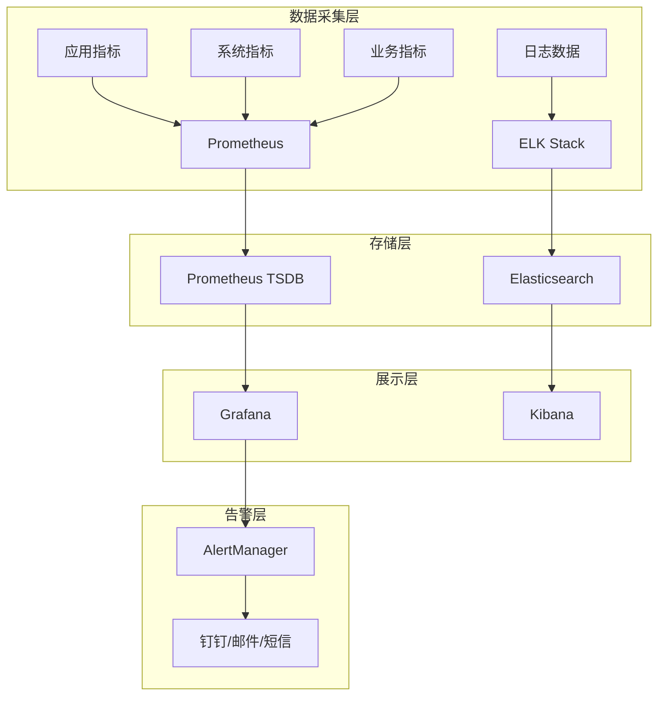

# 12-后端监控运维

## 监控体系架构

### 整体架构



## 系统监控

### 1. Prometheus配置

```yaml
# prometheus.yml
global:
  scrape_interval: 15s
  evaluation_interval: 15s

rule_files:
  - "alert_rules.yml"

alerting:
  alertmanagers:
    - static_configs:
        - targets: ['alertmanager:9093']

scrape_configs:
  - job_name: 'fastapi-app'
    static_configs:
      - targets: ['app:8000']
    metrics_path: '/metrics'
    scrape_interval: 10s

  - job_name: 'node-exporter'
    static_configs:
      - targets: ['node-exporter:9100']

  - job_name: 'redis'
    static_configs:
      - targets: ['redis-exporter:9121']

  - job_name: 'postgres'
    static_configs:
      - targets: ['postgres-exporter:9187']
```

### 2. 应用指标收集

```python
# app/monitoring/metrics.py
from prometheus_client import Counter, Histogram, Gauge, CollectorRegistry
import time
from functools import wraps

# 创建指标注册表
REGISTRY = CollectorRegistry()

# 定义核心指标
REQUEST_COUNT = Counter(
    'http_requests_total',
    'Total HTTP requests',
    ['method', 'endpoint', 'status'],
    registry=REGISTRY
)

REQUEST_DURATION = Histogram(
    'http_request_duration_seconds',
    'HTTP request duration',
    ['method', 'endpoint'],
    registry=REGISTRY
)

ACTIVE_CONNECTIONS = Gauge(
    'websocket_connections_active',
    'Active WebSocket connections',
    registry=REGISTRY
)

TRADE_ORDERS = Counter(
    'trade_orders_total',
    'Total trade orders',
    ['symbol', 'side', 'status'],
    registry=REGISTRY
)

def monitor_requests(func):
    """请求监控装饰器"""
    @wraps(func)
    async def wrapper(*args, **kwargs):
        start_time = time.time()
        try:
            result = await func(*args, **kwargs)
            REQUEST_COUNT.labels(
                method='GET', 
                endpoint=func.__name__, 
                status='200'
            ).inc()
            return result
        except Exception as e:
            REQUEST_COUNT.labels(
                method='GET', 
                endpoint=func.__name__, 
                status='500'
            ).inc()
            raise
        finally:
            REQUEST_DURATION.labels(
                method='GET', 
                endpoint=func.__name__
            ).observe(time.time() - start_time)
    return wrapper

# 业务指标收集器
class BusinessMetrics:
    @staticmethod
    def record_trade_order(symbol: str, side: str, status: str):
        TRADE_ORDERS.labels(symbol=symbol, side=side, status=status).inc()
    
    @staticmethod
    def update_active_connections(count: int):
        ACTIVE_CONNECTIONS.set(count)
```

### 3. 健康检查

```python
# app/monitoring/health.py
import asyncio
import aioredis
import asyncpg
from typing import Dict, Any
from app.core.config import settings

class HealthChecker:
    async def check_database(self) -> Dict[str, Any]:
        try:
            conn = await asyncpg.connect(settings.DATABASE_URL)
            await conn.execute("SELECT 1")
            await conn.close()
            return {"status": "healthy", "latency": 0.001}
        except Exception as e:
            return {"status": "unhealthy", "error": str(e)}
    
    async def check_redis(self) -> Dict[str, Any]:
        try:
            redis = aioredis.from_url(settings.REDIS_URL)
            await redis.ping()
            await redis.close()
            return {"status": "healthy", "latency": 0.001}
        except Exception as e:
            return {"status": "unhealthy", "error": str(e)}
    
    async def check_all(self) -> Dict[str, Any]:
        checks = await asyncio.gather(
            self.check_database(),
            self.check_redis(),
            return_exceptions=True
        )
        
        results = {
            "database": checks[0],
            "redis": checks[1]
        }
        
        overall_healthy = all(
            check.get("status") == "healthy" 
            for check in results.values()
            if isinstance(check, dict)
        )
        
        results["overall"] = "healthy" if overall_healthy else "unhealthy"
        results["timestamp"] = time.time()
        
        return results
```

## 日志管理

### 1. 日志配置

```python
# app/core/logging.py
import logging
import sys
from pathlib import Path
from loguru import logger
from app.core.config import settings

def setup_logging():
    """配置日志系统"""
    logger.remove()
    
    # 控制台输出
    logger.add(
        sys.stdout,
        level="INFO",
        format="<green>{time:YYYY-MM-DD HH:mm:ss}</green> | "
               "<level>{level: <8}</level> | "
               "<cyan>{name}</cyan>:<cyan>{function}</cyan>:<cyan>{line}</cyan> | "
               "<level>{message}</level>",
        colorize=True
    )
    
    # 文件输出
    log_path = Path(settings.LOG_DIR)
    log_path.mkdir(exist_ok=True)
    
    # 应用日志
    logger.add(
        log_path / "app.log",
        level="DEBUG",
        format="{time:YYYY-MM-DD HH:mm:ss} | {level: <8} | {name}:{function}:{line} | {message}",
        rotation="100 MB",
        retention="30 days",
        compression="gz"
    )
    
    # 错误日志
    logger.add(
        log_path / "error.log",
        level="ERROR",
        format="{time:YYYY-MM-DD HH:mm:ss} | {level: <8} | {name}:{function}:{line} | {message}",
        rotation="50 MB",
        retention="90 days",
        compression="gz"
    )

class BusinessLogger:
    @staticmethod
    def log_trade_order(order_data: dict):
        logger.bind(trading=True).info(
            f"Trade Order: {order_data['symbol']} {order_data['side']} "
            f"{order_data['quantity']} @ {order_data['price']}"
        )
    
    @staticmethod
    def log_strategy_signal(strategy: str, signal: dict):
        logger.bind(strategy=True).info(f"Strategy Signal: {strategy} - {signal}")
```

### 2. ELK Stack配置

```yaml
# docker-compose.monitoring.yml
version: '3.8'

services:
  elasticsearch:
    image: docker.elastic.co/elasticsearch/elasticsearch:8.8.0
    environment:
      - discovery.type=single-node
      - xpack.security.enabled=false
      - "ES_JAVA_OPTS=-Xms1g -Xmx1g"
    ports:
      - "9200:9200"
    volumes:
      - elasticsearch_data:/usr/share/elasticsearch/data

  logstash:
    image: docker.elastic.co/logstash/logstash:8.8.0
    volumes:
      - ./logstash/pipeline:/usr/share/logstash/pipeline
      - ./logs:/logs
    ports:
      - "5044:5044"
    depends_on:
      - elasticsearch

  kibana:
    image: docker.elastic.co/kibana/kibana:8.8.0
    ports:
      - "5601:5601"
    environment:
      - ELASTICSEARCH_HOSTS=http://elasticsearch:9200
    depends_on:
      - elasticsearch

volumes:
  elasticsearch_data:
```

## 告警配置

### 1. AlertManager配置

```yaml
# alertmanager.yml
global:
  smtp_smarthost: 'smtp.example.com:587'
  smtp_from: 'alerts@quant-platform.com'

route:
  group_by: ['alertname', 'cluster', 'service']
  group_wait: 10s
  group_interval: 10s
  repeat_interval: 1h
  receiver: 'default'
  routes:
  - match:
      severity: critical
    receiver: 'critical-alerts'

receivers:
- name: 'default'
  email_configs:
  - to: 'admin@quant-platform.com'
    subject: '[ALERT] {{ .GroupLabels.alertname }}'

- name: 'critical-alerts'
  email_configs:
  - to: 'admin@quant-platform.com'
    subject: '[CRITICAL] {{ .GroupLabels.alertname }}'
  webhook_configs:
  - url: 'http://webhook-service:8080/alerts/critical'
```

### 2. 告警规则

```yaml
# alert_rules.yml
groups:
- name: system_alerts
  rules:
  - alert: HighCPUUsage
    expr: 100 - (avg by(instance) (irate(node_cpu_seconds_total{mode="idle"}[5m])) * 100) > 80
    for: 5m
    labels:
      severity: warning
    annotations:
      summary: "High CPU usage detected"

  - alert: DatabaseConnectionFailed
    expr: up{job="postgres"} == 0
    for: 1m
    labels:
      severity: critical
    annotations:
      summary: "Database connection failed"

- name: trading_alerts
  rules:
  - alert: CTPDisconnected
    expr: up{job="ctp"} == 0
    for: 30s
    labels:
      severity: critical
      service: trading
    annotations:
      summary: "CTP connection lost"
```

## 运维工具

### 1. 备份脚本

```bash
#!/bin/bash
# scripts/backup.sh

set -e

BACKUP_DIR="/backup/quant-platform"
DATE=$(date +%Y%m%d_%H%M%S)

mkdir -p "$BACKUP_DIR"

# 数据库备份
echo "Backing up PostgreSQL database..."
docker exec postgres pg_dump -U postgres quant_db | gzip > "$BACKUP_DIR/db_$DATE.sql.gz"

# Redis备份
echo "Backing up Redis data..."
docker exec redis redis-cli --rdb /data/dump.rdb
docker cp redis:/data/dump.rdb "$BACKUP_DIR/redis_$DATE.rdb"

echo "Backup completed successfully!"
```

### 2. 监控脚本

```python
# scripts/monitor.py
#!/usr/bin/env python3
import asyncio
import aiohttp
import json
import time
from typing import Dict, Any

class SystemMonitor:
    def __init__(self):
        self.endpoints = {
            'health': 'http://localhost:8000/health',
            'metrics': 'http://localhost:8000/metrics',
            'ready': 'http://localhost:8000/ready'
        }
    
    async def check_endpoint(self, name: str, url: str) -> Dict[str, Any]:
        try:
            async with aiohttp.ClientSession() as session:
                start_time = time.time()
                async with session.get(url, timeout=10) as response:
                    response_time = time.time() - start_time
                    
                    return {
                        'name': name,
                        'status': 'ok' if response.status == 200 else 'error',
                        'status_code': response.status,
                        'response_time': response_time,
                        'timestamp': time.time()
                    }
        except Exception as e:
            return {
                'name': name,
                'status': 'error',
                'error': str(e),
                'timestamp': time.time()
            }
    
    async def check_all_endpoints(self) -> Dict[str, Any]:
        tasks = [
            self.check_endpoint(name, url) 
            for name, url in self.endpoints.items()
        ]
        
        results = await asyncio.gather(*tasks)
        
        summary = {
            'overall_status': 'ok' if all(r['status'] == 'ok' for r in results) else 'error',
            'checks': results,
            'timestamp': time.time()
        }
        
        return summary

if __name__ == "__main__":
    monitor = SystemMonitor()
    asyncio.run(monitor.check_all_endpoints())
```

