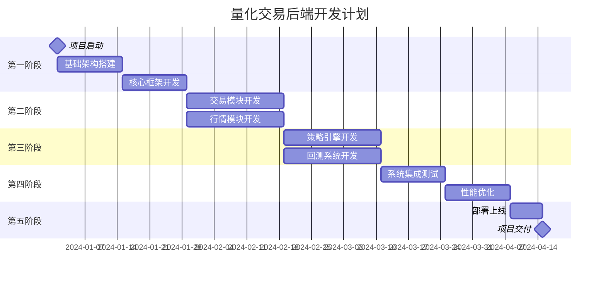

# 16-后端项目计划

## 项目概述

### 项目目标
基于Python技术栈构建高性能量化交易后端系统，支持期货交易、策略回测、实时行情处理等核心功能。

### 项目周期
- **总工期**: 16周（4个月）
- **开发团队**: 8-10人
- **技术栈**: Python + FastAPI + PostgreSQL + Redis + CTP

### 项目阶段划分



## 第一阶段：基础架构（第1-4周）

### 1.1 项目启动（第1周）

**任务清单**:
- [ ] 项目需求分析和确认
- [ ] 技术方案评审
- [ ] 开发环境搭建
- [ ] 代码仓库初始化
- [ ] 团队分工确定

**交付物**:
- 需求规格说明书
- 技术架构设计文档
- 开发环境配置文档
- 项目代码仓库

**负责人**: 架构师 + 项目经理

### 1.2 基础框架搭建（第2-3周）

**任务清单**:
- [ ] FastAPI项目初始化
- [ ] 数据库设计和建表
- [ ] Redis缓存配置
- [ ] 日志系统搭建
- [ ] 配置管理系统
- [ ] 异常处理框架
- [ ] API文档生成

**核心模块**:
```python
# 项目结构
app/
├── core/           # 核心配置
├── models/         # 数据模型
├── api/           # API路由
├── services/      # 业务服务
├── repositories/  # 数据访问
├── utils/         # 工具函数
└── tests/         # 测试代码
```

**交付物**:
- 基础项目框架
- 数据库表结构
- API文档模板
- 开发规范文档

**负责人**: 后端架构师 + 2名开发工程师

### 1.3 认证授权系统（第4周）

**任务清单**:
- [ ] JWT认证实现
- [ ] 用户管理模块
- [ ] 权限控制系统
- [ ] API访问控制
- [ ] 安全中间件

**核心功能**:
- 用户注册/登录
- Token生成和验证
- 权限角色管理
- API访问控制

**交付物**:
- 认证授权服务
- 用户管理API
- 权限控制中间件
- 安全测试报告

**负责人**: 安全工程师 + 1名开发工程师

## 第二阶段：核心业务模块（第5-8周）

### 2.1 交易模块开发（第5-6周）

**任务清单**:
- [ ] CTP接口封装
- [ ] 订单管理系统
- [ ] 持仓管理模块
- [ ] 资金管理服务
- [ ] 风险控制系统
- [ ] 交易API接口

**核心功能**:
```python
# 交易服务示例
class TradingService:
    async def create_order(self, order_data: OrderCreate) -> OrderResponse
    async def cancel_order(self, order_id: str) -> bool
    async def get_positions(self, user_id: int) -> List[Position]
    async def get_account_info(self, user_id: int) -> AccountInfo
```

**技术要点**:
- CTP API异步封装
- 订单状态机设计
- 风险控制算法
- 实时数据同步

**交付物**:
- 交易服务模块
- CTP接口封装
- 交易API文档
- 单元测试用例

**负责人**: 交易系统工程师 + 2名开发工程师

### 2.2 行情模块开发（第7-8周）

**任务清单**:
- [ ] 行情数据接收
- [ ] 实时数据处理
- [ ] K线数据生成
- [ ] 技术指标计算
- [ ] 行情数据存储
- [ ] WebSocket推送

**核心功能**:
```python
# 行情服务示例
class MarketDataService:
    async def get_realtime_data(self, symbol: str) -> MarketData
    async def get_kline_data(self, symbol: str, interval: str) -> List[KLine]
    async def calculate_indicators(self, data: pd.DataFrame) -> Dict
    async def subscribe_symbol(self, symbol: str, callback: Callable)
```

**技术要点**:
- 高频数据处理
- 时序数据存储
- WebSocket实时推送
- 数据压缩优化

**交付物**:
- 行情服务模块
- 数据处理引擎
- WebSocket服务
- 性能测试报告

**负责人**: 行情系统工程师 + 2名开发工程师

## 第三阶段：策略与回测（第9-12周）

### 3.1 策略引擎开发（第9-10周）

**任务清单**:
- [ ] 策略框架设计
- [ ] 策略执行引擎
- [ ] 信号生成系统
- [ ] 策略管理接口
- [ ] 策略监控系统
- [ ] 常用策略实现

**策略框架**:
```python
# 策略基类
class BaseStrategy:
    def __init__(self, parameters: Dict)
    async def initialize(self)
    async def on_market_data(self, data: MarketData)
    async def generate_signals(self) -> List[Signal]
    async def on_order_update(self, order: Order)
```

**预置策略**:
- MACD策略
- 均线策略
- 布林带策略
- RSI策略
- 网格策略

**交付物**:
- 策略执行引擎
- 策略模板库
- 策略管理API
- 策略文档

**负责人**: 策略工程师 + 2名量化研究员

### 3.2 回测系统开发（第11-12周）

**任务清单**:
- [ ] 回测引擎设计
- [ ] 历史数据管理
- [ ] 绩效分析模块
- [ ] 报告生成系统
- [ ] 参数优化功能
- [ ] 回测API接口

**回测功能**:
```python
# 回测服务
class BacktestService:
    async def run_backtest(self, config: BacktestConfig) -> BacktestResult
    async def optimize_parameters(self, strategy: str, ranges: Dict)
    async def generate_report(self, result_id: str) -> Report
    async def compare_strategies(self, strategy_ids: List[str])
```

**性能指标**:
- 总收益率
- 年化收益率
- 最大回撤
- 夏普比率
- 胜率统计
- 盈亏比

**交付物**:
- 回测执行引擎
- 绩效分析模块
- 报告生成系统
- 回测API文档

**负责人**: 回测系统工程师 + 1名量化研究员

## 第四阶段：系统集成与优化（第13-16周）

### 4.1 系统集成测试（第13-14周）

**任务清单**:
- [ ] 模块集成测试
- [ ] 端到端测试
- [ ] 压力测试
- [ ] 安全测试
- [ ] 兼容性测试
- [ ] 问题修复

**测试场景**:
- 完整交易流程测试
- 高并发场景测试
- 异常情况处理测试
- 数据一致性测试
- API接口测试

**测试工具**:
- pytest（单元测试）
- locust（压力测试）
- postman（API测试）
- sonarqube（代码质量）

**交付物**:
- 集成测试报告
- 性能测试报告
- 安全测试报告
- 问题修复记录

**负责人**: 测试工程师 + 全体开发人员

### 4.2 性能优化（第15周）

**任务清单**:
- [ ] 数据库查询优化
- [ ] 缓存策略优化
- [ ] 异步处理优化
- [ ] 内存使用优化
- [ ] 网络传输优化
- [ ] 监控指标完善

**优化重点**:
- API响应时间 < 100ms
- 数据库连接池优化
- Redis缓存命中率 > 90%
- 内存使用率 < 70%
- CPU使用率 < 80%

**优化工具**:
- cProfile（性能分析）
- py-spy（实时分析）
- Redis Monitor（缓存监控）
- PostgreSQL EXPLAIN（查询分析）

**交付物**:
- 性能优化报告
- 监控仪表板
- 性能基准测试
- 优化建议文档

**负责人**: 性能优化工程师 + 架构师

### 4.3 部署上线（第16周）

**任务清单**:
- [ ] 生产环境搭建
- [ ] Docker镜像构建
- [ ] CI/CD流水线配置
- [ ] 监控告警配置
- [ ] 数据迁移
- [ ] 灰度发布
- [ ] 生产验证

**部署架构**:
```yaml
# docker-compose.yml
version: '3.8'
services:
  api:
    image: quant-backend:latest
    ports:
      - "8000:8000"
    environment:
      - DATABASE_URL=postgresql://...
      - REDIS_URL=redis://...
  
  postgres:
    image: timescale/timescaledb:latest
    
  redis:
    image: redis:7-alpine
    
  nginx:
    image: nginx:alpine
```

**交付物**:
- 生产环境部署
- CI/CD流水线
- 监控告警系统
- 部署文档
- 运维手册

**负责人**: DevOps工程师 + 运维工程师

## 团队分工

### 核心团队结构

| 角色 | 人数 | 主要职责 |
|------|------|----------|
| 项目经理 | 1 | 项目管理、进度控制、风险管理 |
| 架构师 | 1 | 技术架构设计、技术难点攻关 |
| 后端工程师 | 4 | 业务模块开发、API实现 |
| 量化研究员 | 2 | 策略开发、回测分析 |
| 测试工程师 | 1 | 测试用例设计、质量保证 |
| DevOps工程师 | 1 | 部署运维、监控告警 |

### 技能要求

**后端工程师**:
- Python 3.9+
- FastAPI/Flask
- PostgreSQL/Redis
- 异步编程
- 金融业务理解

**量化研究员**:
- Python数据分析
- NumPy/Pandas
- 量化策略开发
- 统计学基础
- 金融市场知识

**测试工程师**:
- 自动化测试
- 性能测试
- 安全测试
- pytest/locust

## 风险管理

### 技术风险

| 风险项 | 影响等级 | 应对措施 |
|--------|----------|----------|
| CTP接口稳定性 | 高 | 多重连接、断线重连机制 |
| 高并发性能 | 中 | 压力测试、性能优化 |
| 数据一致性 | 高 | 事务控制、数据校验 |
| 系统安全性 | 高 | 安全审计、渗透测试 |

### 进度风险

| 风险项 | 影响等级 | 应对措施 |
|--------|----------|----------|
| 需求变更 | 中 | 需求冻结、变更控制 |
| 技术难点 | 高 | 技术预研、专家支持 |
| 人员变动 | 中 | 知识共享、文档完善 |
| 外部依赖 | 中 | 多方案准备、提前对接 |

### 质量风险

| 风险项 | 影响等级 | 应对措施 |
|--------|----------|----------|
| 代码质量 | 中 | 代码审查、静态分析 |
| 测试覆盖 | 中 | 测试用例、覆盖率要求 |
| 性能问题 | 高 | 性能测试、持续监控 |
| 安全漏洞 | 高 | 安全扫描、专业审计 |

## 质量保证

### 代码质量标准

**代码规范**:
- PEP 8编码规范
- 类型注解覆盖率 > 90%
- 代码复杂度 < 10
- 单元测试覆盖率 > 80%

**代码审查**:
- 所有代码必须经过审查
- 关键模块双人审查
- 自动化代码质量检查
- 安全代码审查

**文档要求**:
- API文档自动生成
- 核心模块设计文档
- 部署运维文档
- 用户使用手册

### 测试策略

**测试层次**:
- 单元测试（70%）
- 集成测试（20%）
- 端到端测试（10%）

**测试类型**:
- 功能测试
- 性能测试
- 安全测试
- 兼容性测试
- 用户验收测试

**自动化程度**:
- 单元测试 100%自动化
- 集成测试 80%自动化
- 回归测试 100%自动化
- 性能测试 50%自动化

## 项目监控

### 进度监控

**周报内容**:
- 完成任务清单
- 进度达成率
- 风险问题清单
- 下周工作计划

**里程碑检查**:
- 阶段目标达成
- 交付物质量评估
- 技术债务评估
- 团队效能分析

### 质量监控

**代码指标**:
- 代码行数统计
- 复杂度分析
- 测试覆盖率
- 缺陷密度

**性能指标**:
- API响应时间
- 系统吞吐量
- 资源使用率
- 错误率统计

## 成功标准

### 功能完整性
- [ ] 所有API接口实现
- [ ] 核心业务流程完整
- [ ] 策略引擎正常运行
- [ ] 回测系统功能完备

### 性能指标
- [ ] API平均响应时间 < 100ms
- [ ] 系统可用性 > 99.5%
- [ ] 并发用户数 > 1000
- [ ] 数据处理延迟 < 10ms

### 质量标准
- [ ] 单元测试覆盖率 > 80%
- [ ] 代码质量评级 A
- [ ] 安全漏洞 0个高危
- [ ] 文档完整性 100%

### 交付标准
- [ ] 生产环境部署成功
- [ ] 用户验收测试通过
- [ ] 运维文档完整
- [ ] 团队知识转移完成

## 总结

本项目计划涵盖了量化交易后端系统的完整开发流程，从基础架构搭建到最终部署上线。通过合理的阶段划分、明确的任务分工、完善的风险管理和质量保证体系，确保项目能够按时高质量交付。

关键成功因素：
1. **技术架构设计**：合理的分层架构和模块设计
2. **团队协作**：明确分工、高效沟通
3. **质量控制**：全面的测试策略和代码审查
4. **风险管理**：提前识别和应对各类风险
5. **持续优化**：基于监控数据的持续改进 